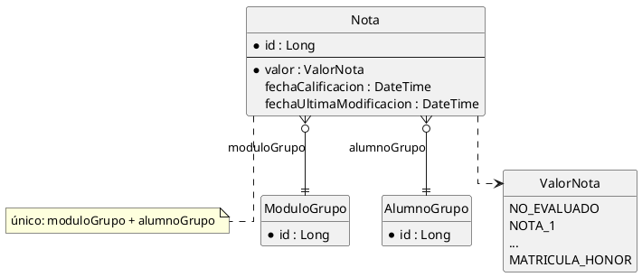

# Contrato — `modelo.puml` (modelo de datos del sistema)

Lo lee el **documentador**. Define cómo derivar el esquema PlantUML del modelo de datos a partir de los `domains/*.xml` del sistema, y cómo renderizar `modelo.png`.

---

## 1. Cuándo se genera

- **Si** el sistema tiene **al menos un** `domains/*.xml` con una `<entity>` → genera `modelo.puml` + `modelo.png` en la raíz del sistema.
- **Si NO** tiene `domains/*.xml` (p.ej. utilidades, infraestructura sin entidades) → **NO** generes `modelo.puml` ni `modelo.png`. Documenta solo el `CLAUDE.md` y omite la sección "Modelo de datos".

---

## 2. Qué entra en el diagrama

1. **Una `entity` por cada `<entity>`** de los `domains/*.xml` **de este sistema** (las que define, no las que solo referencia).
2. **Sus campos**, con tipo legible. Mapea los tags de Axelor:
   - `<string>` → `String`; `<integer>` → `Integer`; `<long>` → `Long`; `<decimal>` → `Decimal`; `<boolean>` → `Boolean`; `<date>` → `Date`; `<datetime>` → `DateTime`; `<time>` → `Time`; `<binary>` → `Binary`; `<text>` → `Text`.
   - `<enum name="x" ref="ValorNota">` → campo `x : ValorNota` (el enum es un tipo; ver §4).
   - **MUST NOT** listar el `id` salvo que el XML lo declare explícitamente; Axelor lo añade solo. Puedes incluir una línea `* id : Long` por convención de PK.
3. **Marca obligatorios**: un campo con `required="true"` se antepone con `*` (notación de PlantUML para "no nulo").
4. **Relaciones** (ver §3): `<many-to-one>`, `<one-to-many>`, `<many-to-many>`.
5. **Enums** definidos en los `domains/*.xml` del sistema (`<enum name="...">`) → como `enum` de PlantUML con sus `<item>` (ver §4).
6. **Restricciones notables** como nota: `<unique-constraint columns="a,b">` → una `note` corta sobre la entidad ("único: a+b"). Los `<finder-method>` **NO** van al diagrama.

**MUST NOT** incluir: métodos, servicios, controladores, vistas (eso es del `CLAUDE.md`), ni campos calculados de UI.

---

## 3. Relaciones (cómo dibujarlas)

| Tag XML | Cardinalidad PlantUML | Dirección |
|---------|----------------------|-----------|
| `<many-to-one name="x" ref="A.B.C">` | `EntidadActual }o--|| C` | muchos-a-uno hacia `C` (nombre del `ref` sin paquete) |
| `<one-to-many name="x" ref="C" mappedBy="...">` | `EntidadActual ||--o{ C` | uno-a-muchos hacia `C` |
| `<many-to-many name="x" ref="C">` | `EntidadActual }o--o{ C` | muchos-a-muchos |

Reglas:

- El `ref` se da como FQCN (`com.educaflow.system.gruposnotas.db.ModuloGrupo`). Usa **solo el nombre simple** (`ModuloGrupo`) como nodo.
- **Etiqueta** la relación con el `name` del campo (`: moduloGrupo`).
- **Relación a entidad de OTRO sistema o de Axelor** (p.ej. `ref="com.axelor.auth.db.User"`): dibuja la entidad externa como nodo **marcado como externo** (ver §4: `entity User <<externo>>`) y NO le pongas campos (no es tuya). Así el esquema muestra la frontera del sistema.
- **MUST NOT** duplicar una relación bidireccional: si A tiene `<one-to-many>` a B con `mappedBy` y B tiene el `<many-to-one>` inverso, dibuja **una** línea (la del lado dueño, el `many-to-one`), no dos.

---

## 4. Plantilla literal de `modelo.puml`

Estructura exacta (rellena con las entidades reales del sistema; este ejemplo es ilustrativo):



Para entidades externas (de otro sistema o de Axelor), el nodo lleva el estereotipo `<<externo>>` y no se le ponen miembros:

```plantuml
entity User <<externo>> {
}
TareaFirma }o--|| User : firmante
```

Reglas de la plantilla:

- **MUST** empezar por `@startuml` y terminar por `@enduml`.
- **MUST** incluir `hide circle`, `hide empty members` y `skinparam linetype ortho` (legibilidad).
- Un enum referenciado por un campo se enlaza con `Entidad ..> NombreEnum` (dependencia punteada), opcional pero recomendado si el enum se define en el sistema.
- **MUST NOT** inventar entidades, campos ni relaciones que no estén en los `domains/*.xml`. El diagrama es un reflejo fiel del XML.

---

## 5. Render a `modelo.png`

Tras escribir `modelo.puml`, renderiza con el comando del `README.md` §3 (el jar se resuelve desde `~/.m2`, no se vendoriza):

```bash
PLANTUML_JAR=$(find ~/.m2/repository/net/sourceforge/plantuml/plantuml \
  -name 'plantuml-*.jar' ! -name '*-sources.jar' ! -name '*-javadoc.jar' | sort -V | tail -1)
java -Djava.awt.headless=true -Djava.io.tmpdir="${TMPDIR:-/tmp}" \
  -jar "$PLANTUML_JAR" -tpng {ruta-sistema}/modelo.puml
```

Verifica con `Bash` que `{ruta-sistema}/modelo.png` existe y pesa `> 0 bytes`. Si falla o queda a 0 bytes, corrige la sintaxis del `.puml` y reintenta (**LIMIT** 3). Si tras la 3ª no renderiza → `BLOQUEADO: {ruta-sistema} — el modelo.puml no renderiza: {último error}`.

---

## 6. Checklist del documentador (parte modelo de datos)

Solo aplica si el sistema tiene `domains/*.xml`. Antes de devolver el token, **MUST** auto-verificar:

- [ ] ¿Hay una `entity` en el `.puml` por cada `<entity>` de los `domains/*.xml` del sistema?
- [ ] ¿Cada `<many-to-one>`/`<one-to-many>`/`<many-to-many>` está como relación, con la cardinalidad de §3 y sin duplicar bidireccionales?
- [ ] ¿Las entidades de otros sistemas/Axelor están como nodo `<<externo>>` sin campos?
- [ ] ¿Los enums definidos en el sistema están como `enum` con sus `<item>`?
- [ ] ¿Empieza por `@startuml` y termina por `@enduml`?
- [ ] ¿`modelo.png` existe y pesa `> 0 bytes` tras el render?
- [ ] ¿No inventaste nada que no esté en el XML?

**LIMIT**: máximo 3 iteraciones de corrección. Si tras la 3ª sigue fallando, devuelve `BLOQUEADO` con el motivo.
