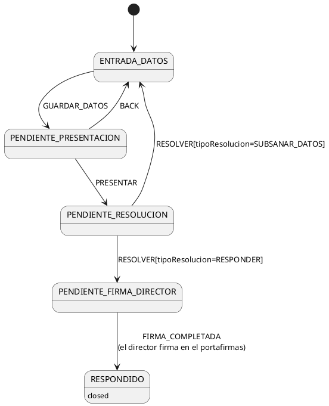

# El trámite

La **instancia general** permite a un alumno presentar al centro una solicitud genérica —expone unos hechos y solicita algo— cuando ningún otro trámite se ajusta a su caso; el centro la estudia y responde, pudiendo antes pedir la subsanación de los datos. Aparece en la rama de **alumnos** del árbol de crear expedientes y es un trámite **público**. Es la **primera versión** de un trámite nuevo.

**Texto de ayuda del árbol:** Presente una solicitud general al centro cuando ningún otro trámite se ajuste a su caso. Describa su situación y lo que solicita; recibirá la respuesta del centro por correo electrónico.

# Actores y perfiles

- **Alumno solicitante**: presenta la instancia, corrige lo que el centro le pida subsanar y recibe la respuesta.
- **Secretario**: estudia cada instancia y decide si responderla o pedir subsanación.
- **Director**: firma las respuestas del centro. No interviene en la tramitación: firma desde su portafirmas.

| Perfil | Quién lo recibe | Ámbito | ¿Nuevo? |
|---|---|---|---|
| CREADOR | el alumno que crea el expediente | individual | no |
| RESPONSABLE | el secretario del centro | centro | no |

El director **no necesita perfil**: nunca tiene el turno del expediente — firma la respuesta en su portafirmas (ver [documento-respuesta.md](./documento-respuesta.md)).

# Fases

| Fase | Objetivo en este trámite | Estados que aporta | Desviaciones del catálogo |
|---|---|---|---|
| F_ENTRADA | el alumno redacta la instancia con sus adjuntos, la firma con AutoFirma y la presenta | F_ENTRADA_DATOS, F_ENTRADA_PENDIENTE_PRESENTACION_AUTOFIRMA | sin revisión (`hay_revision: no`): lo presentado lo revisa el secretario al resolver, en F_SALIDA. La instancia se genera al pulsar «Siguiente» (efecto de TR-001), no al entrar al estado de presentación |
| F_SALIDA | el secretario responde la instancia (o pide su subsanación) y el centro emite la respuesta firmada por el director | F_SALIDA_PENDIENTE_RESOLUCION, F_SALIDA_PENDIENTE_FIRMA_DIRECTOR | el evento de salida es RESOLVER, con una rama de subsanación que devuelve el expediente a F_ENTRADA_DATOS (asume la subsanación que F_ENTRADA no ofrece al no tener revisión). La respuesta no se firma en el servidor: la firma un **ajeno** (el director) en el portafirmas — de ahí el estado de espera añadido F_SALIDA_PENDIENTE_FIRMA_DIRECTOR, y el registro de salida y el correo ocurren al completarse esa firma (TR-005), no en el propio RESOLVER |
| F_TERMINADO | la instancia queda respondida y consultable por el alumno | F_TERMINADO_RESPONDIDO | el estado final toma el sufijo RESPONDIDO (único desenlace) |

No hay fase F_INICIO: el trámite no necesita pantalla de ayuda previa (el estado inicial es F_ENTRADA_DATOS).

**Parámetros de F_ENTRADA:**

- campos: la exposición, la solicitud y los adjuntos
- validaciones: la exposición y la solicitud son obligatorias
- modo_presentacion: solo_autofirma
- documento_solicitud: [documento-instancia.md](./documento-instancia.md)
- hay_revision: no

**Parámetros de F_SALIDA:**

- campos: el tipo de resolución, la respuesta y los datos a subsanar
- documento_respuesta: [documento-respuesta.md](./documento-respuesta.md)
- firmante: el director del centro (vía portafirmas — ver desviaciones)
- destino_atras: sin_atras

# Historias de usuario

## HU-001 — Como Alumno quiero presentar una instancia general para pedir al centro algo que ningún otro trámite cubre

- ESC-001 — Presentación (camino feliz):
  1. El alumno «alumno1@mislata.es» inicia sesión con contraseña «demo1234».
  2. Abre «Crear un nuevo expediente» y elige «Instancia general».
  3. Rellena la exposición con «He perdido el resguardo de matrícula del curso 2025/2026» y la solicitud con «Solicito un duplicado del resguardo de matrícula».
  4. Añade un adjunto con nombre «DNI escaneado» y el fichero «dni.pdf».
  5. Pulsa «Siguiente»; el expediente pasa a F_ENTRADA_PENDIENTE_PRESENTACION_AUTOFIRMA y muestra el PDF de la instancia con los datos introducidos.
  6. Pulsa «Firmar con AutoFirma y Presentar la solicitud», acepta la confirmación y firma con su certificado (DNI 86862719E).
  7. El expediente pasa a F_SALIDA_PENDIENTE_RESOLUCION; en el historial de estados consta el registro de entrada con su resguardo sellado.
- ESC-002 — Solicitud vacía:
  1. El alumno «alumno1@mislata.es» inicia sesión con contraseña «demo1234».
  2. Abre «Crear un nuevo expediente» y elige «Instancia general».
  3. Rellena la exposición con «He perdido el resguardo de matrícula» y deja la solicitud vacía.
  4. Pulsa «Siguiente».
  5. El sistema muestra «La solicitud es obligatoria» y el expediente sigue en F_ENTRADA_DATOS.
- ESC-003 — Volver atrás para corregir:
  1. El alumno «alumno1@mislata.es» inicia sesión con contraseña «demo1234».
  2. Crea una instancia general, rellena la exposición con «He perdido el resguardo» y la solicitud con «Solicito un duplicado», y pulsa «Siguiente».
  3. En F_ENTRADA_PENDIENTE_PRESENTACION_AUTOFIRMA pulsa «Atrás»; el expediente vuelve a F_ENTRADA_DATOS con los datos editables.
  4. Corrige la exposición añadiendo «del curso 2025/2026» y pulsa «Siguiente».
  5. El PDF de la instancia se muestra regenerado con el texto corregido.
- ESC-004 — Borrado en entrada de datos:
  1. El alumno «alumno1@mislata.es» inicia sesión con contraseña «demo1234».
  2. Crea una instancia general y rellena la exposición con «Prueba».
  3. Pulsa el botón de borrar el expediente y acepta la confirmación.
  4. El expediente desaparece de su bandeja.

## HU-002 — Como Secretario quiero resolver las instancias presentadas para responderlas o pedir su subsanación

- ESC-005 — Respuesta con firma del director:
  1. El alumno «alumno1@mislata.es» inicia sesión con contraseña «demo1234», crea una instancia general con exposición «He perdido el resguardo de matrícula del curso 2025/2026» y solicitud «Solicito un duplicado del resguardo de matrícula», pulsa «Siguiente» y la presenta firmando con AutoFirma.
  2. Cierra sesión. El secretario «secretario@mislata.es» inicia sesión con contraseña «demo1234» y abre el expediente desde su bandeja de pendientes.
  3. Elige el tipo de resolución «Responder», escribe la respuesta «Puede recoger el duplicado del resguardo en la secretaría del centro» y pulsa «Resolver el expediente», aceptando la confirmación.
  4. El expediente pasa a F_SALIDA_PENDIENTE_FIRMA_DIRECTOR.
  5. Cierra sesión. El director «director@mislata.es» inicia sesión con contraseña «demo1234», abre su portafirmas y firma el documento de la respuesta.
  6. El expediente pasa a F_TERMINADO_RESPONDIDO; en el historial de estados consta el registro de salida y el alumno recibe un correo con la respuesta sellada adjunta.
- ESC-006 — Subsanación y re-presentación:
  1. El alumno «alumno1@mislata.es» inicia sesión con contraseña «demo1234», crea una instancia general con exposición «He perdido el resguardo» y solicitud «Solicito un duplicado», pulsa «Siguiente» y la presenta firmando con AutoFirma.
  2. Cierra sesión. El secretario «secretario@mislata.es» inicia sesión, abre el expediente desde su bandeja, elige «Subsanar datos», escribe en los datos a subsanar «Indique el curso al que corresponde el resguardo» y pulsa «Resolver el expediente», aceptando la confirmación.
  3. El expediente vuelve a F_ENTRADA_DATOS y el alumno recibe un correo con los datos a subsanar.
  4. Cierra sesión. El alumno «alumno1@mislata.es» inicia sesión, abre el expediente desde su bandeja y ve el aviso con la disconformidad «Indique el curso al que corresponde el resguardo».
  5. Corrige la exposición añadiendo «del curso 2025/2026», pulsa «Siguiente» y vuelve a firmar con AutoFirma y presentar.
  6. El expediente vuelve a F_SALIDA_PENDIENTE_RESOLUCION y el secretario recibe de nuevo el aviso de instancia pendiente.
- ESC-007 — Resolver sin elegir resolución:
  1. El alumno «alumno1@mislata.es» inicia sesión con contraseña «demo1234», crea una instancia general con exposición «He perdido el resguardo» y solicitud «Solicito un duplicado», pulsa «Siguiente» y la presenta firmando con AutoFirma.
  2. Cierra sesión. El secretario «secretario@mislata.es» inicia sesión y abre el expediente desde su bandeja.
  3. Pulsa «Resolver el expediente» sin elegir el tipo de resolución y acepta la confirmación.
  4. El sistema muestra «Debe elegir una resolución» y el expediente sigue en F_SALIDA_PENDIENTE_RESOLUCION.

## HU-003 — Como Alumno quiero consultar mi expediente en todo momento para saber cómo va mi solicitud

- ESC-008 — Consulta durante la tramitación y tras la respuesta:
  1. El alumno «alumno1@mislata.es» inicia sesión con contraseña «demo1234», crea una instancia general con exposición «He perdido el resguardo de matrícula del curso 2025/2026» y solicitud «Solicito un duplicado», pulsa «Siguiente» y la presenta firmando con AutoFirma.
  2. Abre el expediente desde su bandeja: lo ve todo en solo lectura, con el resguardo sellado de la presentación, y sale con «Salir».
  3. Cierra sesión. El secretario «secretario@mislata.es» inicia sesión, abre el expediente, elige «Responder», escribe «Puede recogerlo en secretaría» y resuelve.
  4. Cierra sesión. El director «director@mislata.es» inicia sesión y firma la respuesta en su portafirmas.
  5. Cierra sesión. El alumno «alumno1@mislata.es» inicia sesión y vuelve a abrir el expediente: está en F_TERMINADO_RESPONDIDO y ve la respuesta sellada.
- ESC-009 — Ámbito individual y por centro:
  1. El alumno «alumno1@mislata.es» inicia sesión con contraseña «demo1234», crea una instancia general con exposición «He perdido el resguardo» y solicitud «Solicito un duplicado», pulsa «Siguiente» y la presenta firmando con AutoFirma.
  2. Cierra sesión. El alumno «alumno2@mislata.es» inicia sesión con contraseña «demo1234»: su bandeja no muestra el expediente de Alumno1.
  3. Cierra sesión. El secretario «secretario@batoi.es» inicia sesión con contraseña «demo1234»: su bandeja de pendientes tampoco lo muestra.

# Modelos

| Fichero | Modelo | Qué representa |
|---|---|---|
| [entity-InstanciaGeneral.md](./entity-InstanciaGeneral.md) | InstanciaGeneral | el expediente: la solicitud del alumno y la resolución del centro |
| [entity-AdjuntoInstancia.md](./entity-AdjuntoInstancia.md) | AdjuntoInstancia | cada documento que el alumno aporta junto a la instancia |

La instancia tiene N adjuntos, que se borran con ella.

# Estados y transiciones

El expediente nace en entrada de datos, el alumno lo presenta firmándolo con AutoFirma (registro de entrada) y el secretario lo resuelve: o pide subsanación (vuelve al alumno y se re-presenta) o responde, en cuyo caso la respuesta pasa por la firma del director en el portafirmas y se emite por registro de salida, quedando el expediente cerrado. El detalle vive en [estados.md](./estados.md).

# Vistas

En entrada de datos el alumno redacta la instancia y sus adjuntos; en pendiente de presentación revisa el PDF generado y lo firma; en pendiente de resolución el secretario ve lo presentado y resuelve; en pendiente de firma del director y en respondido solo hay consulta. El detalle vive en [vistas.md](./vistas.md).

# Documentos

| Fichero | Documento | Qué es |
|---|---|---|
| [documento-instancia.md](./documento-instancia.md) | Instancia | la solicitud que el alumno firma y presenta por registro de entrada |
| [documento-respuesta.md](./documento-respuesta.md) | Respuesta | la respuesta del centro, firmada por el director y emitida por registro de salida |

# Subsistemas utilizados

| Subsistema | Dónde se usa |
|---|---|
| Documentos PDF | RN-TR-001-001 (generar la instancia), RN-TR-004-001 (generar la respuesta) |
| Registro de entrada | RN-TR-003-002 (presentar la instancia firmada) |
| Registro de salida | RN-TR-005-001 (emitir la respuesta firmada) |
| Firma en pantalla (AutoFirma) | FIR-instancia-001 |
| Portafirmas (subsistema Firmas) | FIR-respuesta-001, RN-F_SALIDA_PENDIENTE_FIRMA_DIRECTOR-001, TR-005 |
| Correos | RN-F_SALIDA_PENDIENTE_RESOLUCION-001, RN-TR-004-002, RN-TR-005-002 |

# Recursos y datos iniciales

*(no aplica)*

# Fuera de alcance

- Presentar la instancia en nombre de otra persona (representante legal): la presenta siempre el propio interesado.
- Plazos de resolución y silencio administrativo: el centro responde sin plazo tasado.
- Recursos contra la respuesta del centro.
