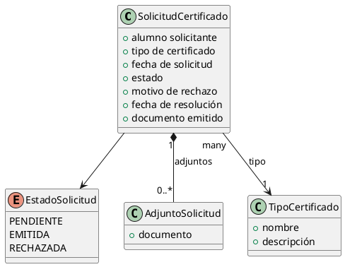

# Guía de los ficheros de la especificación

Explica qué debe contener cada fichero de la especificación, cómo clasificar sus elementos y cómo numerarlos. Esta guía dirige la redacción y la revisión de la spec; **MUST NOT** copiarse ninguno de sus bloques explicativos al output.

Es **el único fichero de esta carpeta de plantillas que el skill `sdd-specification` conoce por nombre**: el skill lee este `README.md` y, a través de él, descubre y usa el resto. Por eso aquí se declara qué hay en la carpeta y cómo se usa cada cosa.

## Ficheros de esta carpeta de plantillas

| Fichero | Qué es | Cómo se usa |
|---|---|---|
| `README.md` | **Esta guía**: el conjunto de ficheros, los apartados de cada uno, la clasificación de los elementos y las reglas de numeración. | Es la única referencia que el skill conoce por nombre; dirige las preguntas de la Fase 2 y las validaciones de la Fase 3. **MUST NOT** copiarse al output. |
| `specification.md` | **La plantilla del índice.** | Se reproduce **literalmente**, sustituyendo los placeholders por contenido real. Produce **un** fichero índice (el único con frontmatter `type: specification`). |
| `entity.md` | **La plantilla de los ficheros de modelo.** | Se instancia tantas veces como modelos defina la spec, una por `entity-<Nombre>.md`. |
| `screen.md` | **La plantilla de los ficheros de pantalla.** | Se instancia tantas veces como pantallas defina la spec, una por `screen-<slug>.md`. |
| `catalogo-validaciones.md` | **Catálogo de referencia** de tipos de validación por ámbito (campo propio, entre campos, entre registros, de negocio). | Se consulta al rellenar Restricciones y Validaciones. **MUST NOT** copiarse al output. |
| `example/` | **Carpeta con un ejemplo completo** de spec terminada e instanciada (índice + un `entity-*.md` por modelo + un `screen-*.md` por pantalla). | Referencia del aspecto final. **MUST NOT** copiarse su contenido al output. |

## Ficheros que produce la especificación

La especificación **no es un único fichero**: es un conjunto de ficheros dentro de la carpeta de la iniciativa.

| Fichero | Plantilla | Qué contiene                                                                                                                                                                                                                     |
|---|---|----------------------------------------------------------------------------------------------------------------------------------------------------------------------------------------------------------------------------------|
| `specification.md` | `specification.md` | El **índice**: objetivo, actores, historias de usuario con sus escenarios, las **tablas de enlaces** a los modelos y a las pantallas, seguridad, recursos y fuera de alcance. Es el único con frontmatter `type: specification`. |
| `entity-<Nombre>.md` | `entity.md` | Un fichero **por cada modelo**: su descripción, campos, estados, restricciones (`RES-`), campos calculados (`CC-`) y, por evento, validaciones (`VAL-`) y reglas de negocio (`RN-`).                                             |
| `screen-<slug>.md` | `screen.md` | Un fichero **por cada pantalla**: su identidad, menú, vistas, botones y reglas de UI (`RUI-`).                                                                                                                                   |
| `model.puml` | *(sin plantilla; PlantUML)* | Un **único** fichero por spec: el **diagrama de clases** en PlantUML de los modelos definidos en los `entity-*.md` y de sus relaciones. Es una vista de conjunto; no añade información nueva.                                       |
| `model.png` | *(sin plantilla; imagen)* | Un **único** fichero por spec: la **imagen** del diagrama, renderizada **siempre** a partir de `model.puml` (nunca a mano). Se (re)genera cada vez que se crea o cambia `model.puml`.                                                |

- `<Nombre>` del modelo va en **PascalCase** (p. ej. `entity-SolicitudCertificado.md`); `<slug>` de la pantalla en **kebab-case** (p. ej. `screen-mis-certificados.md`). `model.puml` y `model.png` son **nombres fijos** (uno por spec), sin sufijo variable.
- Solo `specification.md` lleva frontmatter. Los `entity-*.md` y `screen-*.md` empiezan directamente por su `# Modelo: …` / `# Pantalla: …`. `model.puml` empieza por `@startuml` y termina por `@enduml`.

---

## Reglas transversales

### Identificadores numerados

Historias, escenarios y reglas llevan IDs estables para que el diseño pueda comprobar que **ninguno se pierde**: cada regla del diseño declara de qué IDs de la spec proviene, y cada test E2E de qué escenario.

| Elemento | Prefijo | Ámbito de numeración | Dónde vive |
|---|---|---|---|
| Historias de usuario | `HU-NNN` | Global a la spec | `specification.md` |
| Escenarios | `ESC-NNN` | Global a la spec (no por historia) | `specification.md` |
| Restricciones | `RES-NNN` | Global a la spec (no por entidad) | `entity-*.md` |
| Validaciones | `VAL-NNN` | Global a la spec (no por evento) | `entity-*.md` |
| Reglas de negocio | `RN-NNN` | Global a la spec | `entity-*.md` |
| Reglas de UI | `RUI-NNN` | Global a la spec | `screen-*.md` |
| Campos calculados | `CC-NNN` | Global a la spec | `entity-*.md` |

- La numeración es **global a toda la spec**, no por fichero: el primer `VAL-` del proyecto es `VAL-001` esté en el modelo que esté, y el siguiente `VAL-` (aunque sea en otro `entity-*.md`) es `VAL-002`.
- Numeración desde `001`, **tres dígitos**, sin huecos al crear.
- **Los IDs no se renumeran nunca.** Al borrar un elemento su número se conserva como hueco (no se reutiliza), para no romper la trazabilidad con un diseño ya generado.
- **MUST NOT** usar otra taxonomía de reglas ni otros prefijos que los de esta tabla: la conversión a la taxonomía técnica de reglas es trabajo del diseño.
- ✅ CORRECTO: `HU-002`, `ESC-001`, `VAL-007`, `RN-012`
- ❌ INCORRECTO: `VAL-1` (sin tres dígitos), `VALIDACION-001` (prefijo inventado, no es uno de la tabla), `VAL-Pedido-001` (la numeración es global, sin entidad), `ESC_001` (guión bajo), `HU-001-ESC-001` (el escenario no anida el ID de la historia; la pertenencia se expresa agrupándolo bajo ella).

### Lenguaje de negocio

¿Lo entendería un supervisor del centro sin formación técnica? Si **no**, no va en la spec. Cada apartado de esta guía indica qué SÍ y qué NO admite. Esto aplica **a los tres tipos de fichero**: ni el índice ni los ficheros de modelo ni los de pantalla llevan tipos de dato, FQN, JPQL, atributos XML ni nombres de método. La única excepción es el término `AllowProperties` (dentro de las acciones de cada modelo), que se nombra explícitamente como concepto de seguridad. Qué propiedad puede enviar la interfaz se expresa en lenguaje de negocio en ese apartado; el detalle técnico de cada campo es trabajo del diseño.

---

# El índice — `specification.md`

## Objetivo

**Qué va:** una frase con lo que tiene que hacer; si es un **sistema** o un **subsistema**; las dependencias funcionales de subsistemas existentes, en lenguaje de negocio.

**Qué NO va:** rutas de código, nombres de paquete.

## Actores

Los actores que intervienen en la spec: quiénes son y qué papel juegan. (Los **modelos** ya no se describen aquí: cada uno tiene su `entity-*.md`; en el índice solo aparece la tabla de enlaces del apartado Modelos.)

## Historias de usuario

Usando los actores y el vocabulario de los modelos. Cada historia es un encabezado `## HU-NNN — Como [Actor] quiero [feature] para [motivo]` y, **debajo de cada historia, van sus escenarios** `ESC-NNN`: las secuencias de acciones que muestran cómo funciona esa historia. No hay un apartado de escenarios aparte — cada escenario vive bajo la historia a la que pertenece.

Cada historia tiene **al menos un escenario** y cada escenario pertenece a exactamente una historia (la que lo contiene). Los escenarios deben cubrir el camino feliz (happy path), los alternativos y los errores/excepciones.

**CRITICAL — claridad, especificidad y explicitud.** Cada escenario debe ser **muy claro, específico y explícito**: nombra los datos concretos que se usan (no «un alumno» sino «el alumno Juan Pérez»), el valor exacto que se introduce en cada campo, la acción precisa que dispara cada paso y la respuesta literal del sistema (el texto del mensaje, el estado resultante). Nada se deja implícito ni a interpretación: quien lo lea para construir el test E2E debe poder reproducir cada paso sin tener que adivinar ningún dato, condición ni resultado.

**CRITICAL — formato y autosuficiencia.** Cada `ESC-NNN` se convierte en el diseño en un test E2E que se ejecuta contra una aplicación recién arrancada, **sin estado previo**. Por eso **cada escenario se escribe SIEMPRE como una lista de pasos numerados** (un paso por línea); **MUST NOT** escribirse como varias frases separadas por «;» en una sola línea, aunque el escenario sea simple. La secuencia es **completa, verificable y autosuficiente**:

1. Empieza con el actor **iniciando sesión** en la aplicación.
2. Sigue con la **preparación**: el actor (u otro actor que también inicia sesión dentro del escenario) crea todos los datos que la prueba necesita, hasta llegar al estado que se quiere probar. El único estado previo admisible es el descrito en "Recursos y datos iniciales".
3. Realiza la **acción que se prueba**.
4. Termina con la **respuesta del sistema**.

Entre medias puede haber más pasos y **ramas condicionales** (*"si \<condición\> el sistema hace X; si no, hace Y y no hace Z"*). Un escenario con ramas puede dar lugar a **más de un test** en el diseño (uno por rama).

**Formato:**

```
## HU-001 — Como [Actor] quiero [feature] para [motivo]

- ESC-001 — <Nombre corto>:
  1. <El actor inicia sesión.>
  2. <Prepara los datos que necesita la prueba.>
  3. <Realiza la acción que se prueba.>
  4. <El sistema responde.>
- ESC-002 — <Nombre corto>:
  1. <El actor inicia sesión.>
  2. <Prepara los datos que necesita la prueba.>
  3. <Realiza la acción que se prueba.>
  4. Si <condición>: <el sistema hace esto>.
  5. Si no: <el sistema hace esto otro y no hace aquello>.

## HU-002 — Como [Actor] quiero [feature] para [motivo]

- ESC-003 — <Nombre corto>:
  1. …
```

- ✅ CORRECTO (simple, pero igualmente en pasos numerados):
  ```
  - ESC-004 — Rechazo sin motivo:
    1. El secretario inicia sesión.
    2. Crea una solicitud de certificado para un alumno y la envía.
    3. Abre la solicitud recibida y pulsa Rechazar sin indicar motivo.
    4. El sistema muestra «El motivo es obligatorio».
  ```
- ✅ CORRECTO (con rama condicional):
  ```
  - ESC-007 — Emisión con y sin email del alumno:
    1. El alumno inicia sesión, crea una solicitud de «Certificado de matrícula» y la envía.
    2. El secretario inicia sesión, abre la solicitud pendiente y pulsa Emitir.
    3. El sistema comprueba que está PENDIENTE, genera el documento a partir de la plantilla y pasa la solicitud a EMITIDA.
    4. Si el alumno tiene email registrado: el sistema le envía un correo con el certificado adjunto.
    5. Si no tiene email: el sistema no envía ningún correo y la solicitud queda EMITIDA igualmente.
  ```
- ❌ INCORRECTO (varias frases en una sola línea): *"ESC-004 — Rechazo sin motivo: el secretario inicia sesión; crea una solicitud y la envía; abre la solicitud y pulsa Rechazar sin motivo; el sistema muestra «El motivo es obligatorio»."* (los pasos **MUST** ir uno por línea en una lista numerada, no como frases separadas por «;»).
- ❌ INCORRECTO (presupone estado): un `ESC` cuyo primer paso es *"El secretario abre una solicitud pendiente y la rechaza sin motivo"* presupone que ya existe esa solicitud y que hay sesión iniciada — faltan los pasos de login y preparación, así que el test E2E no podría llegar a ese estado.

**Qué NO va:** nombres de clase, pantallas técnicas, capas; en los escenarios, además, nombres técnicos de botón/campo/método, comandos de testing y pasos Given/When/Then (eso es del diseño).

## Modelos

Una **tabla índice** con una fila por modelo: el enlace a su `entity-<Nombre>.md`, el nombre del modelo y una línea de qué representa. Debajo de la tabla, las **relaciones entre modelos** en lenguaje de negocio (padre/hijo, borrado en cascada, referencias opcionales a entidades externas).

- Cada modelo que aparezca en la tabla **MUST** tener su `entity-<Nombre>.md`, y al revés.
- **Qué NO va:** tipos de campo, anotaciones JPA, FQN. El detalle de cada modelo vive en su fichero.

## Pantallas

Una **tabla índice** con una fila por pantalla: el enlace a su `screen-<slug>.md`, el nombre de la pantalla y una línea de para qué sirve y a quién.

- Cada pantalla que aparezca en la tabla **MUST** tener su `screen-<slug>.md`, y al revés.
- Una **pantalla** (una fila de la tabla, un `screen-*.md`) normalmente se compone de **varias vistas** que se abren unas a otras: como mínimo suele haber un **listado** y su **formulario** de detalle, y a menudo además los formularios de sus hijos maestro-detalle. En la tabla del índice va **una fila por pantalla**, no por vista; las vistas se detallan dentro del `screen-*.md`.
- Si varios puntos de entrada **distintos** abren el **mismo** formulario en modo detalle, ese formulario se describe **una sola vez** como una pantalla compartida (un único `screen-*.md`), y los demás lo referencian; así se evita duplicarlo.
- **Qué NO va:** nombres técnicos de acciones o vistas del framework, dominios JPQL.

## Seguridad

Quién puede ver/crear/editar/borrar cada cosa, en lenguaje natural:

- **Declarar solo los roles que tienen algún acceso** (tipos de usuario y cargos de `CLAUDE.md`). La seguridad es **deny by default**: un rol que no se declara no tiene acceso, así que **no se listan los roles "sin acceso"**.
- Por cada rol con acceso, indicar **qué puede ver/crear/editar/borrar** y su **alcance por centro**: si solo ve lo de su propio centro, todos los centros o solo sus propios registros. No hay un flag global de "multicentro" — el alcance por centro forma parte de la descripción de cada rol.
- Aun así, hay que **considerar todos los roles del proyecto** al redactar, para no olvidar **conceder** acceso a uno que sí lo necesita; las dudas se resuelven preguntando, no escribiendo líneas "sin acceso".

## Recursos y datos iniciales

Recursos estáticos que necesita la funcionalidad (plantillas PDF, esquemas XSD, certificados…) y datos que deben precargarse al arrancar (catálogos, registros iniciales). Si no hay, indicar `*(no aplica)*`.

Este apartado es el **único estado previo** que los escenarios pueden presuponer.

## Fuera de alcance

Lo que el negocio decide **no** hacer.

---

# Los ficheros de modelo — `entity-<Nombre>.md`

Un fichero por cada modelo de la tabla "Modelos" del índice. Describe el modelo **como concepto del dominio** y aloja sus restricciones, campos calculados, las propiedades editables por acción (`AllowProperties`), validaciones y reglas de negocio. El título es `# Modelo: <Nombre>`.

## Descripción

Párrafo inicial bajo el título: qué representa el modelo, qué papel juega, su ciclo de vida resumido y si extiende o reutiliza algo existente, en lenguaje de negocio.

## Campos

Los campos **funcionalmente relevantes**, uno por viñeta, con su nombre conceptual y qué representa.

**Un campo NO declara “obligatorio” ni “inmutable”** — esos no son atributos del campo, son reglas, y duplicarlos aquí entra en conflicto con su sección propia:

- **Obligatorio** es una regla: si debe cumplirse en todo evento es una **restricción** (`RES-NNN`); si solo en un evento concreto es una **validación** (`VAL-NNN`). No se marca en el campo.
- **Inmutable / no editable** lo gobierna **AllowProperties**: un campo que no aparezca en la línea `AllowProperties` de la acción `Modificar` no lo puede cambiar el cliente. No se marca en el campo.
- **Valores** de un campo de estado van en «Estados y transiciones»; los de otro enum sin ciclo de vida, en la propia descripción.

**Qué NO va:** tipos de campo, campos técnicos (IDs, FKs internas, auditoría, flags, versiones), anotaciones JPA. Qué campos puede enviar la interfaz se expresa en la línea `AllowProperties` de la acción correspondiente, no campo a campo aquí.

## Estados y transiciones

Solo si el modelo tiene ciclo de vida: su estado inicial, las transiciones (qué acción o circunstancia lleva de un estado a otro) y cuál es terminal. Si no tiene ciclo de vida, se omite la sección.

## Restricciones

**Qué son:** invariantes de una entidad. Condiciones que deben cumplirse siempre, independientemente de la acción que se ejecute. Si se viola una restricción, el objeto está en un estado inválido.

**Cómo se asocian:** a la entidad, no a una acción concreta.

**Regla de clasificación:** si la condición debe cumplirse en todas las acciones de la entidad, es una restricción. Si solo aplica a una acción concreta, es una validación.

**REQUIRED — identificación:** para no olvidar ninguna restricción, recorre el catálogo `catalogo-validaciones.md` (sobre todo las tablas "entre registros" y "de negocio": unicidad, cardinalidad de hijos, inmutabilidad por estado) y comprueba, campo a campo, cuáles aplican siempre (→ restricción) y cuáles solo en una acción (→ validación). El catálogo es una ayuda **no exhaustiva**: si el negocio necesita una restricción que no aparece en él, decláralo igualmente.

**Ejemplo:**

**Restricciones:**

- RES-001 — El número de expediente es único en el sistema
- RES-002 — La fecha de cierre no puede ser anterior a la fecha de apertura

## Campos calculados

**Qué son:** valores de la entidad que el sistema calcula automáticamente. Nunca los proporciona el cliente; siempre los calcula el servidor.

**Atributos obligatorios:**

| Atributo | Valores | Descripción |
|---|---|---|
| `momento` | `lectura` \| `escritura` | Cuándo se calcula |
| `sobreescribible` | `nunca` \| lista de roles | Quién puede forzar un valor manual |
| `cálculo` | descripción en lenguaje de negocio | Cómo se obtiene el valor (la fórmula o regla de derivación) |

- `momento: lectura` → el valor se deriva en memoria cada vez que se lee la entidad. No se persiste.
- `momento: escritura` → el valor se calcula antes de persistir y se guarda en base de datos.

**Convención global:** un campo calculado nunca se acepta del cliente. Si el cliente envía un valor para un campo calculado, se ignora, salvo que el rol del usuario esté en la lista `sobreescribible`.

**Ejemplo:**

**Campos calculados:**

- CC-001 — total
  - momento: escritura
  - sobreescribible: nunca
  - cálculo: suma de (cantidad × precio_unitario) de todas las líneas
- CC-002 — descuento_especial
  - momento: escritura
  - sobreescribible: [ADMIN]
  - cálculo: 0 por defecto; el administrador puede indicar un valor distinto

## Acción: `<NombreAcción>`

Un encabezado `## Acción: <Nombre>` por cada acción de la entidad (Crear, Modificar, Emitir, Rechazar, …) que tenga algo que declarar. Dentro de cada acción, en este orden, las etiquetas en negrita `**Input AllowProperties:**`, `**Validaciones:**` y `**Reglas de negocio:**` (omite la que no aplique). Cada validación o regla lleva una viñeta y sus atributos como **sub-viñetas** (`key: valor`).

**Cuándo existe una acción:** tiene encabezado si declara propiedades editables, validaciones o reglas de negocio. **Crear** y **Modificar** se declaran **SIEMPRE** (al menos su línea de `AllowProperties`, aunque sea `(ninguna)`); las demás acciones aparecen solo si reciben datos del formulario o tienen validaciones o reglas.

### Input AllowProperties

**Qué es:** la lista de propiedades que la interfaz puede enviar al servidor en esa acción, en una línea `**Input AllowProperties:** <propiedades>` o `(ninguna — <motivo>)`. `AllowProperties` es el único término técnico que se nombra en la spec.

**Por qué (seguridad):** es una defensa **anti mass-assignment**. Cualquier propiedad que llegue desde la interfaz y **no** esté en la lista se ignora: los campos calculados, de estado, de auditoría y los inmutables solo los fija el servidor. Sin esta lista, el cliente podría modificar campos internos que no le corresponden.

**Reglas de redacción:**

- **Crear (alta)** y **Modificar** llevan su línea de `AllowProperties` **SIEMPRE**, aunque sea `(ninguna — <motivo>)`. **CRITICAL**: no omitir ninguna de las dos.
- El resto de acciones lleva la línea **solo si recibe datos** del formulario; una acción que no recibe datos (p.ej. Emitir) **MUST NOT** incluir la línea.
- Un campo **calculado (`CC-`)** o **inmutable** no aparece en la acción que no lo permite: un campo inmutable va en **Crear** pero **MUST NOT** ir en **Modificar**; un `CC` con `sobreescribible: nunca` **MUST NOT** ir en ninguna acción.
- Las propiedades listadas **MUST** existir en "Campos" o "Campos calculados" de la entidad.
- Lenguaje de negocio: nombres funcionales de propiedad, no tipos ni atributos técnicos.
- **MUST NOT** usar `todas`: la lista es siempre cerrada (propiedades explícitas o `(ninguna)`).
- **CRITICAL — referencia al padre en un alta dentro de un formulario hijo maestro-detalle.** Si la entidad se da de alta **dentro del formulario de su padre** (el formulario del hijo se abre embebido en un panel maestro-detalle del padre — ver «Una pantalla casi siempre tiene varias vistas»), la **referencia al padre SÍ va en `AllowProperties` de Crear**: la interfaz la rellena con el registro padre y la envía, porque el servidor que procesa el alta del hijo no puede deducir por su cuenta cuál es el padre. Al convertirse en un dato que dicta el cliente, **MUST** acompañarse **siempre** de las otras dos piezas: (a) una **regla de UI** que fije esa referencia desde el padre (ver «Reglas de UI») y (b) una **validación** que compruebe el padre recibido (ver «Validaciones»). La regla de UI **no es la defensa** —un cliente puede saltársela—; la defensa es la validación.

### Validaciones

**Qué son:** comprobaciones bloqueantes asociadas a una acción concreta. Si fallan, la acción se cancela y no ocurre ningún cambio en el sistema. En la spec basta con clasificarlas bien; el pipeline las materializa más adelante.

**Cómo se asocian:** a una acción de una entidad.

**REQUIRED — identificación:** para identificar qué validaciones aplican a cada campo, recorre el catálogo de tipos de validación `catalogo-validaciones.md` (campo propio, entre campos del mismo registro, entre registros, de negocio); sus columnas de mensaje sirven de guía para redactar el `mensaje` en lenguaje de negocio. El catálogo es una ayuda **no exhaustiva**: si el negocio necesita una validación que no aparece en él, declárala igualmente.

**REQUIRED — referencia al padre recibida del cliente:** si una propiedad que **referencia al padre** llega del cliente porque el alta ocurre dentro de un formulario hijo maestro-detalle (está en la línea `AllowProperties` de Crear por la regla anterior), declara validaciones que comprueben ese padre: que **está indicado**, que el usuario **tiene permiso sobre él** (su centro o su alcance), y que el **estado del padre admite** la operación. Sin estas validaciones, un cliente manipulado podría apuntar a un padre ajeno (de otro centro, o ya cerrado) saltándose la regla de UI que lo rellena — el padre es un dato del cliente, no una verdad del servidor.

**El texto es la aserción; `condición` es la guardia.** El **texto** de la validación es *lo que debe cumplirse* (la aserción que, si no se da, bloquea). El atributo `condición` es la **guardia**: *cuándo* se evalúa la validación. Son cosas distintas — si la guardia repite lo que ya afirma el texto, la validación nunca falla y sobra. Por eso una precondición de estado pura ("la solicitud está en estado PENDIENTE") va como **texto**, no como `condición`.

**Atributos opcionales:**

- `condición`: la guardia que decide **cuándo aplica** la validación, en lenguaje de negocio (un estado u otra circunstancia). Si no se cumple, la validación no se evalúa (no bloquea).
- `mensaje`: el error que se devuelve al cliente si falla.
- `actor`: el rol que dispara la acción (las validaciones pueden diferir por actor).

### Reglas de negocio

**Qué son:** operaciones que el sistema ejecuta automáticamente como reacción a una acción ya confirmada. No bloquean. No deciden si la acción ocurre. Solo actúan.

**Atributo obligatorio** — `fase`:

- `antes_de_commit` → se ejecuta en la misma transacción. Si falla, hace rollback.
- `después_de_commit` → se ejecuta una vez confirmada la transacción. Un fallo no revierte la acción principal.

**Atributos opcionales:**

- `estado`: el estado de la entidad para que la regla aplique.
- `condición`: cualquier otra condición adicional.

**Ejemplo completo** (una acción que reúne las tres etiquetas, de SolicitudCertificado):

```
## Acción: Rechazar

**Input AllowProperties:** motivo de rechazo

**Validaciones:**

- VAL-004 — La solicitud está en estado PENDIENTE
  - mensaje: "Solo se pueden rechazar solicitudes pendientes"
- VAL-005 — El motivo de rechazo está indicado
  - mensaje: "El motivo es obligatorio"

**Reglas de negocio:**

- RN-005 — Enviar al alumno un correo con el motivo del rechazo
  - fase: después_de_commit
```

(`fecha de solicitud` es `CC` → nunca editable; `estado`, `fecha de resolución` y `documento emitido` los fija el servidor → fuera de toda línea de `AllowProperties`. La acción `Emitir` no recibe datos → no lleva línea de `AllowProperties`.)

---

# El diagrama de clases — `model.puml` y `model.png`

Un **único** fichero `model.puml` por spec con un diagrama de clases en **PlantUML** que representa visualmente los modelos definidos en los `entity-<Nombre>.md` y cómo se relacionan, más su imagen renderizada `model.png`. Es una **vista de conjunto**: de un vistazo se ven todas las entidades de la spec y sus relaciones.

**No añade información nueva.** Todo lo que contiene ya está en los `entity-*.md` (campos, estados) y en el apartado «Modelos» del índice (relaciones). Si el diagrama y el texto discrepan, **manda el texto** y hay que corregir el diagrama. Por eso `model.puml` (y su `model.png`) se **regeneran** cada vez que se crea la spec o cambia **cualquier entidad o relación** (un campo, un estado, una entidad nueva o borrada, una multiplicidad). En modo "refinar", si ninguna entidad ni relación cambió, **MUST NOT** tocarlos.

## Qué contiene

- Una **clase** por cada modelo de la tabla «Modelos» del índice (una por `entity-*.md`).
- Dentro de cada clase, sus **campos** funcionalmente relevantes (los de la sección «Campos» de su `entity-*.md`), uno por línea.
- Un **enum** por cada campo de estado con ciclo de vida, con sus valores (los de «Estados y transiciones»), enlazado a la clase que lo usa.
- Las **relaciones entre modelos** descritas bajo la tabla «Modelos» del índice: **composición** para el maestro-detalle con borrado en cascada, **asociación** para una referencia, con su **multiplicidad**.

## Qué NO va

- **Tipos de dato, FQN, anotaciones JPA, visibilidad técnica:** igual que en los `entity-*.md`, los campos van **sin tipo** — solo el nombre de negocio (PlantUML permite omitirlo: `+ tipo de certificado`).
- **Campos técnicos** (IDs, FKs internas, auditoría, versiones), que tampoco aparecen en los `entity-*.md`.
- **Métodos:** una entidad de la spec no declara métodos.

## Sintaxis y convenciones

- El fichero empieza por `@startuml` y termina por `@enduml`.
- Nombre de clase en **PascalCase**, idéntico al `<Nombre>` de su `entity-*.md`.
- Relaciones (la flecha sale del padre):
  - `*--` **composición** para maestro-detalle con borrado en cascada (los hijos no viven sin el padre);
  - `-->` **asociación** para una referencia a otra entidad independiente (opcional o no);
  - **multiplicidad** entre comillas en los extremos (`"1"`, `"0..*"`, `"many"`).
- Un enum se declara con `enum <Nombre>` y se enlaza con `-->` a la clase que lo usa.

**Ejemplo** (coherente con `entity-SolicitudCertificado.md`, `entity-AdjuntoSolicitud.md` y `entity-TipoCertificado.md` del ejemplo):



## Render a `model.png`

`model.png` es la imagen de `model.puml` y **MUST** obtenerse **siempre** renderizando el `.puml` con PlantUML, **nunca** dibujarse a mano. Se (re)renderiza cada vez que `model.puml` se crea o cambia.

- En la **carpeta de la iniciativa** (donde está `model.puml`), resuelve la **última** versión del jar de PlantUML del repositorio Maven local (`~/.m2`, ya presente porque `EducaFlowBuildTools` lo usa) y renderiza:
  ```bash
  PLANTUML_JAR=$(find ~/.m2/repository/net/sourceforge/plantuml/plantuml \
    -name 'plantuml-*.jar' ! -name '*-sources.jar' ! -name '*-javadoc.jar' | sort -V | tail -1)
  java -Djava.awt.headless=true -Djava.io.tmpdir="${TMPDIR:-/tmp}" \
    -jar "$PLANTUML_JAR" -tpng model.puml
  ```
  - **CRITICAL — `-Djava.awt.headless=true`** es obligatorio: sin él PlantUML aborta buscando un servidor X11 (`Can't connect to X11 window server`).
  - **CRITICAL — `-Djava.io.tmpdir="${TMPDIR:-/tmp}"`** es obligatorio: ImageIO escribe caché temporal y `/tmp` puede estar en solo lectura (sandbox) → `Can't create cache file!`.
- Si PlantUML no está disponible (`PLANTUML_JAR` vacío) o el render falla, **MUST NOT** fallar en silencio: conserva `model.puml` y **avisa al usuario** de que falta `model.png`.

---

# Los ficheros de pantalla — `screen-<slug>.md`

Un fichero por cada pantalla de la tabla "Pantallas" del índice. Describe la pantalla en lenguaje de negocio y aloja sus reglas de UI. El título es `# Pantalla: <Nombre>`.

## Una pantalla casi siempre tiene varias vistas

Lo que el usuario percibe como **una pantalla** casi nunca es una sola vista. Lo **mínimo habitual** es un **listado** (grid) y el **formulario** de detalle que ese listado abre; y muy a menudo hay más vistas que se van **abriendo unas a otras**:

- un **listado** que, al pulsar una fila o con «Nuevo», abre el **formulario de detalle** de ese registro;
- un **formulario** con un panel **maestro-detalle**: ese panel es a su vez un **listado** (grid) de los hijos embebido en el formulario y, al pulsar una fila (o «Añadir»), abre el **formulario del hijo**;
- un **botón** que abre otra vista.

Por eso, al bajar por la jerarquía, las vistas **alternan listado y formulario**: un listado abre un formulario, ese formulario contiene un listado de hijos (el panel maestro-detalle), que abre el formulario del hijo, que contiene otro listado, y así sucesivamente (**grid → formulario → grid → formulario → …**).

Todas las vistas alcanzables **en línea** desde un mismo punto de entrada se describen en **un único** `screen-*.md` (no en uno por vista). Ejemplo: una pantalla «Ciclo» encadena listado de ciclos → formulario de ciclo → listado de cursos (panel «Cursos») → formulario de curso → listado de módulos (panel «Módulos») → formulario de módulo: seis vistas que alternan grid y formulario, **un solo** fichero de pantalla. La regla de «formulario compartido» sigue valiendo: si distintos puntos de entrada abren el **mismo** formulario, ese formulario es una pantalla compartida con su propio `screen-*.md`.

**CRITICAL — un nodo del árbol es un hijo maestro-detalle, NO un selector de campo.** Acota la regla anterior: «vista alcanzable en línea» se refiere a los **hijos maestro-detalle** (un panel que lista los hijos que *pertenecen* al registro y abre el formulario de cada hijo), no a los selectores de un campo. Distingue:

- **SÍ es un nodo del árbol** — un panel **maestro-detalle**: lista los registros hijos que pertenecen al registro padre y abre el formulario del hijo. En «Ciclo», los paneles «Cursos» y «Módulos» son nodos.
- **NO es un nodo del árbol** — el **selector de un campo que referencia otra entidad**: el desplegable o popup con el que el usuario **elige** un registro ya existente de *otra* entidad independiente (no lo crea ni lo edita aquí). Esa otra entidad tiene su propia pantalla en otro sitio; en esta solo aparece como **un campo más** de su panel, sin sección `## Vista` propia. En «Ciclo», los campos `familia profesional`, `grado` y `nivel` son selectores → **no** son nodos del árbol, solo campos.

Por eso un `screen-*.md` describe **siempre** sus vistas de la misma forma, haya una o varias: tras `Identidad` y `Menú`, una sección `## Estructura jerárquica de las vistas` con el árbol y luego una sección `## Vista: <Nombre>` por cada vista, cada una con su ficha breve y sus `### Paneles`, `### Botones` y `### Reglas de UI` (ver los ejemplos `screen-mis-solicitudes.md` y `screen-solicitudes-centro.md`). **No hay un formato aparte para el caso de una sola vista:** si la pantalla es un único formulario (un asistente, un formulario de configuración) o un grid suelto, el árbol es un único nodo y hay una sola sección `## Vista` — exactamente la misma estructura.

## Identidad

- **Quién la usa:** los roles que ven o usan la pantalla y en qué modo cada uno.
- **Qué muestra:** qué presenta el conjunto, sobre qué modelo(s), con qué filtro en lenguaje natural y en qué modo (lectura/edición), incluidas las relaciones maestro-detalle inline si las hay.

## Menú

El menú que da entrada a la pantalla: dónde cuelga en la jerarquía y quién lo ve. El menú lleva a la **vista de entrada** (la raíz del árbol, normalmente el listado). Si la pantalla no cuelga de ningún menú sino que se abre desde otra pantalla (p. ej. un formulario compartido), indícalo así.

## Estructura jerárquica de las vistas

Siempre presente. Un árbol con las vistas que componen la pantalla y, **entre paréntesis, cómo se llega de cada vista padre a su hija**: al pulsar una fila del listado o con «Nuevo», desde un panel maestro-detalle concreto, al pulsar un botón. La raíz es la vista de entrada. Si la pantalla tiene una sola vista, el árbol es ese único nodo.

Recuerda que un panel **maestro-detalle** es a la vez un nodo del árbol (un **listado** de hijos) y un panel de la vista padre: por eso el árbol alterna listado y formulario.

```
Listado de ciclos
└── Formulario de ciclo   (se abre al pulsar una fila o con «Nuevo»)
    └── Listado de cursos   (panel maestro-detalle «Cursos» del formulario de ciclo)
        └── Formulario de curso   (se abre al pulsar una fila del listado de cursos o con «Añadir»)
            └── Listado de módulos   (panel maestro-detalle «Módulos» del formulario de curso)
                └── Formulario de módulo   (se abre al pulsar una fila del listado de módulos o con «Añadir»)
```

## Vista: `<Nombre>`

Una sección `## Vista: <Nombre>` por cada vista del árbol, en el mismo orden (al menos una). Toda vista empieza por la **misma ficha** y luego trae **solo las subsecciones propias de su tipo**: un **listado** (grid) y un **formulario** no se describen igual — un listado no tiene paneles, y un formulario no tiene columnas. La ficha común:

- **Tipo:** `listado` | `formulario` | `gráfica` | …
- **Qué muestra:** sobre qué modelo, con qué filtro en lenguaje natural y en qué modo (lectura/edición).
- **Se abre desde:** cómo se llega a esta vista:
  - un **formulario** se abre desde su listado: «el listado de cursos, al pulsar una fila o «Añadir»»;
  - un **listado embebido** (un panel maestro-detalle) no se abre, va dentro de su formulario padre: «embebido como panel «Cursos» en el formulario de ciclo»;
  - la **raíz** del árbol: «es la vista de entrada de la pantalla».

Tras la ficha, **usa solo las subsecciones del tipo de la vista**, como se detalla a continuación. La subsección `### Reglas de UI` es común a cualquier tipo y va siempre la última.

### Subsecciones de un listado (grid)

Un listado **no tiene paneles**. Lleva una subsección `### Propiedades` con, una por viñeta y en lenguaje de negocio:

- **Columnas (en orden):** los campos que se ven como columnas, en el orden en que aparecen.
- **Ordenación por defecto:** por qué campo y en qué sentido se ordenan las filas (o «sin orden definido»).
- **Búsqueda / filtros:** si el usuario puede filtrar la lista y por qué campos (o «no»).
- **Al pulsar una fila abre:** qué formulario abre el listado (o «no abre detalle»). Es la arista del árbol que sale de este listado.
- **Mensaje de ayuda (opcional):** un texto de ayuda que el listado muestra al usuario (p. ej. «Aquí se listan todos los ciclos que hay en el sistema»). Solo si lo hay; si no, se omite la viñeta.

Y una subsección `### Botones` con **dos clases** de acción, marcando entre paréntesis cuál es cada una:

- las de la **barra superior** (`Nuevo`, `Añadir…`): crean o añaden registros a la lista;
- las de **fila/columna** (`Descargar`, `Ver…`): actúan sobre la fila seleccionada.

Si no hay botones, `*(sin botones)*`.

### Subsecciones de un formulario

Un formulario lleva `### Propiedades`, `### Paneles` y `### Botones`.

`### Propiedades`, una viñeta:

- **Modo:** cuándo el formulario es editable y cuándo es de solo lectura (p. ej. «editable en el alta; en detalle, solo lectura»). Si siempre es editable o siempre de solo lectura, dilo.
- **Mensaje de ayuda (opcional):** un texto de ayuda que el formulario muestra al usuario. Solo si lo hay; si no, se omite la viñeta.

`### Paneles` — los bloques visibles del formulario, uno por viñeta: el **título** del panel en negrita, su **tipo** entre paréntesis y, tras un `—`, qué campos o contenido agrupa, en lenguaje de negocio. Tipos de panel:

- **normal** — campos del propio modelo;
- **maestro-detalle → «<vista listado hija>»** — lista los hijos que pertenecen al registro y abre su formulario; es a la vez un nodo del árbol;
- **botonera** — solo botones (que se enumeran igualmente en `### Botones`).

Un campo que **referencia otra entidad** (el usuario elige un registro existente con un selector) se lista como **un campo más** del panel, no como una vista. Por defecto basta con el nombre del campo: el diseño ya sabe con qué vista se elige. **Solo si** hace falta una vista distinta de la por defecto, anótalo entre paréntesis en lenguaje de negocio (p. ej. `nivel (se elige del catálogo de niveles de grado superior)`).

`### Botones` — las acciones del formulario, una por viñeta: la etiqueta en negrita y, tras un `—`, qué acción de negocio dispara y cuándo es visible. Si no hay, `*(sin botones)*`.

### Subsecciones de una gráfica u otra vista no-formulario

Lleva solo `### Propiedades` describiendo sus **parámetros de entrada** y qué **representa** (qué datos agrega y cómo), en vez de paneles.

**Qué NO va (en cualquier tipo):** nombres técnicos de vista, de campo o de acción del framework, atributos XML, dominios JPQL.

### Reglas de UI

**Qué son:** condiciones que cambian el aspecto o el estado de un formulario en función del valor de uno o varios campos, del usuario actual, del registro padre o de un evento (al crear, al cargar, al cambiar un campo). Solo afectan a lo que **ve** y puede editar el usuario en pantalla — **no bloquean operaciones ni modifican el estado del sistema**.

**Cómo se asocian:** a una **vista** (un formulario), **no** a una entidad — por eso viven en el `screen-*.md`, no en el `entity-*.md`, en el `### Reglas de UI` de la vista a la que afectan. Si una misma conducta se necesita en otra vista, es otra regla de UI con su propio ID. La numeración `RUI-NNN` es **global a toda la spec** (no por vista ni por pantalla): el siguiente `RUI-` continúa la cuenta esté en la vista que esté.

**Regla mnemotécnica para distinguirlas:**

- Validación → "no puedes" (bloquea la operación). Si la regla impide guardar, es una **validación** (va en el `entity-*.md`), no una regla de UI.
- Regla de negocio → "ahora hago esto" (escribe en BD o produce efectos colaterales). Si la regla escribe en BD o envía un correo, es una **regla de negocio** (va en el `entity-*.md`), no una regla de UI.
- Regla de UI → "ahora ves esto" (solo cambia el formulario).

**Atributos opcionales:**

- `disparador`: cuándo se aplica — un evento (al crear, al cargar, al cambiar un campo concreto) o `continuo` cuando se evalúa permanentemente.
- `condición`: la expresión que decide si el efecto se aplica. Si es `Siempre`, no hay condición.
- `actor`: el rol del usuario, cuando el efecto depende de quién mira la pantalla.

**Efectos típicos:** mostrar/ocultar un campo o panel, marcar un campo como solo lectura u obligatorio, fijar un valor por defecto al crear, filtrar las opciones de un campo relacional, cambiar el título de un campo.

**Convención de redacción:** describir qué **ve** el usuario, no cómo se implementa. Un valor por defecto al crear es una regla de UI (no una regla de negocio), porque no se escribe nada hasta que el usuario pulsa Guardar. Si una regla combina varios efectos sobre campos distintos, separarla en varias reglas de UI.

**CRITICAL — fijar el padre en el alta de un formulario hijo maestro-detalle.** Cuando un formulario es el **alta de un hijo embebido en el formulario de su padre** (un panel maestro-detalle), declara **siempre** una regla de UI que **fije la referencia al padre** con el registro padre desde el que se abre el formulario (un valor por defecto al crear). Es el origen del dato que viaja en la línea `AllowProperties` de Crear del hijo (ver «Input AllowProperties»). Recuerda que esta regla de UI **no es una defensa**: solo rellena el campo en pantalla; que ese padre sea legítimo lo garantiza la **validación** del hijo (ver «Validaciones»), no la regla de UI. Si el hijo cuelga de varios niveles (padre, abuelo…), declara una regla de UI por cada referencia que el formulario deba fijar.

**Ejemplo** (en `screen-formulario-expediente.md`):

**Reglas de UI:**

- RUI-001 — El campo motivo de rechazo solo se muestra cuando el estado es RECHAZADO
  - disparador: continuo
  - condición: estado == RECHAZADO
- RUI-002 — Al crear un expediente, el centro se rellena con el centro del usuario actual
  - disparador: al crear
  - condición: Siempre
- RUI-003 — El botón Publicar solo lo ve el administrador
  - disparador: al cargar
  - condición: Siempre
  - actor: [ADMIN]

---

## Ejemplo de pantalla de varias vistas

Esqueleto de un `screen-*.md` con seis vistas que **alternan listado y formulario** (maestro-detalle de dos niveles, como `Ciclo.xml`), abreviado. El árbol de «Estructura jerárquica de las vistas» va, en el fichero real, en su propio bloque de código:

````
# Pantalla: Ciclo

## Identidad
- **Quién la usa:** Administrador, en edición.
- **Qué muestra:** el listado de ciclos formativos y, al entrar en uno, su configuración con los cursos y, dentro de cada curso, sus módulos.

## Menú
- Configuración → Ciclos — lo ve el Administrador; lleva a esta pantalla.

## Estructura jerárquica de las vistas
Listado de ciclos
└── Formulario de ciclo   (se abre al pulsar una fila o con «Nuevo»)
    └── Listado de cursos   (panel maestro-detalle «Cursos» del formulario de ciclo)
        └── Formulario de curso   (se abre al pulsar una fila del listado de cursos o con «Añadir»)
            └── Listado de módulos   (panel maestro-detalle «Módulos» del formulario de curso)
                └── Formulario de módulo   (se abre al pulsar una fila del listado de módulos o con «Añadir»)

## Vista: Listado de ciclos
- **Tipo:** listado
- **Qué muestra:** los ciclos formativos, en lectura.
- **Se abre desde:** es la vista de entrada de la pantalla.
### Propiedades
- **Columnas (en orden):** código, nombre, familia profesional
- **Ordenación por defecto:** por nombre, ascendente
- **Búsqueda / filtros:** no
- **Al pulsar una fila abre:** el formulario de ciclo
- **Mensaje de ayuda (opcional):** «Aquí se listan todos los ciclos que hay en el sistema»
### Botones
- **Nuevo ciclo** (barra superior) — Abre el formulario de alta de un ciclo.

## Vista: Formulario de ciclo
- **Tipo:** formulario
- **Qué muestra:** los datos del ciclo, en edición.
- **Se abre desde:** el listado de ciclos, al pulsar una fila o «Nuevo».
### Propiedades
- **Modo:** editable.
### Paneles
- **Ciclo** (normal) — código, nombre, familia profesional, grado, nivel
- **Cursos** (maestro-detalle → «Listado de cursos») — los cursos del ciclo
### Botones
- **Guardar** — Guarda el ciclo.

## Vista: Listado de cursos
- **Tipo:** listado
- **Qué muestra:** los cursos del ciclo, en lectura.
- **Se abre desde:** embebido como panel «Cursos» en el formulario de ciclo.
### Propiedades
- **Columnas (en orden):** código, nombre, ley educativa
- **Ordenación por defecto:** por nombre, ascendente
- **Búsqueda / filtros:** no
- **Al pulsar una fila abre:** el formulario de curso
### Botones
- **Añadir un nuevo curso** (barra superior) — Abre el formulario de alta de un curso.

## Vista: Formulario de curso
- **Tipo:** formulario
- **Qué muestra:** los datos de un curso del ciclo, en edición.
- **Se abre desde:** el listado de cursos, al pulsar una fila o «Añadir un nuevo curso».
### Propiedades
- **Modo:** editable.
### Paneles
- **Curso** (normal) — código, nombre, ley educativa
- **Módulos** (maestro-detalle → «Listado de módulos») — los módulos del curso
### Botones
- **Guardar** — Guarda el curso.

## Vista: Listado de módulos
- **Tipo:** listado
- **Qué muestra:** los módulos del curso, en lectura.
- **Se abre desde:** embebido como panel «Módulos» en el formulario de curso.
### Propiedades
- **Columnas (en orden):** módulo
- **Ordenación por defecto:** por nombre del módulo, ascendente
- **Búsqueda / filtros:** no
- **Al pulsar una fila abre:** el formulario de módulo
### Botones
- **Añadir un nuevo módulo** (barra superior) — Abre el formulario de alta de un módulo.

## Vista: Formulario de módulo
- **Tipo:** formulario
- **Qué muestra:** el módulo asociado al curso, en edición.
- **Se abre desde:** el listado de módulos, al pulsar una fila o «Añadir un nuevo módulo».
### Propiedades
- **Modo:** editable.
### Paneles
- **Módulo** (normal) — módulo
### Botones
- **Guardar** — Guarda el módulo.
````

(Los `RUI-NNN`, si los hubiera, se reparten entre los `### Reglas de UI` de cada vista pero comparten la numeración global de la spec.)
