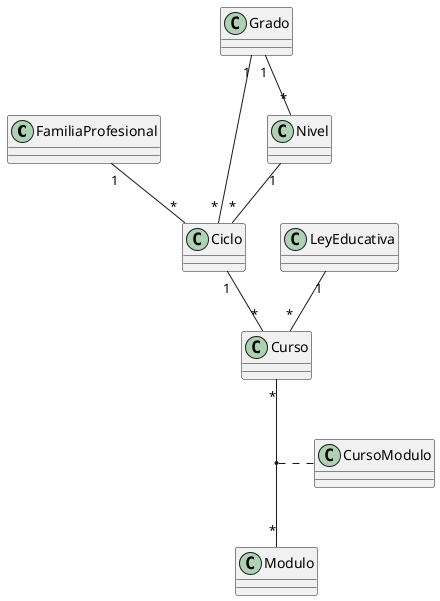

# Diseño: El nivel de un ciclo depende del grado

**Objetivo:** que el catálogo de niveles cuelgue del de grados y que el nivel de un ciclo se exija exactamente cuando su grado tiene niveles, quede vacío cuando no los tiene y pertenezca siempre al grado del ciclo.
**Capa:** subsystem/sistemaeducativo
**Especificación de origen:** .sdd/drafts/2026-09-11_08-46_nivel-segun-grado-del-ciclo/specification.md
**Skills necesarios para la implementación:** k-sistemas, k-code-quality, k-secure-coding, k-vistas, k-validaciones, k-datainit

> Las decisiones difíciles (dónde vive «el grado admite nivel», cómo llega a la vista, la corrección del mapeador, la forma de las tres restricciones, el alcance de los servicios y la maquetación condicional) están razonadas con sus alternativas en `decisiones.md`.

## Ficheros a crear o modificar

| Fichero | Acción | Skill | Descripción |
|---------|--------|-------|-------------|
| `src/main/java/com/educaflow/base/infrastructure/mapper/BeanMapperModel.java` | Modificar | k-code-quality, k-secure-coding | Sustituir la referencia many-to-one cuando el cliente elige **otra** entidad (hoy solo se hace para `MetaFile`). Sin esto, `validateUpdate` valida el grado antiguo (ver Paso 1 y `decisiones.md` D3). |
| `src/main/java/com/educaflow/subsystem/sistemaeducativo/domains/Grado.xml` | Modificar | k-sistemas (modelos.md) | + `one-to-many niveles` (inversa de `Nivel.grado`) y + `boolean admiteNivel` transitorio calculado (`CC-Grado-001`). |
| `src/main/java/com/educaflow/subsystem/sistemaeducativo/domains/Nivel.xml` | Modificar | k-sistemas (modelos.md) | + `many-to-one grado required="true"` (`RES-Nivel-001`, capa declarativa). |
| `src/main/java/com/educaflow/subsystem/sistemaeducativo/domains/Ciclo.xml` | Modificar | k-sistemas (modelos.md) | **Sin delta de campos**: se copia verbatim (el fichero real no cambia). El nivel sigue siendo opcional en el modelo porque su obligatoriedad es condicional. |
| `src/main/java/com/educaflow/subsystem/sistemaeducativo/domains/tablas.plantuml` | Modificar | k-sistemas (modelos.md) | Añadir `Grado`, `Nivel` y las tres relaciones nuevas; regenerar el PNG (`GenerateDocs`). |
| `src/main/java/com/educaflow/subsystem/sistemaeducativo/service/NivelService.java` | Crear | k-sistemas (servicios.md) | Interfaz del servicio de `Nivel`. |
| `src/main/java/com/educaflow/subsystem/sistemaeducativo/service/impl/NivelServiceImpl.java` | Crear | k-sistemas, k-validaciones, k-secure-coding | `V-Nivel-001` + whitelists de alta y modificación. |
| `src/main/java/com/educaflow/subsystem/sistemaeducativo/service/CicloService.java` | Crear | k-sistemas (servicios.md) | Interfaz del servicio de `Ciclo`. |
| `src/main/java/com/educaflow/subsystem/sistemaeducativo/service/impl/CicloServiceImpl.java` | Crear | k-sistemas, k-validaciones, k-secure-coding | `V-Ciclo-001`, `V-Ciclo-002`, `V-Ciclo-003` + whitelists de alta y modificación. |
| `src/main/java/com/educaflow/subsystem/sistemaeducativo/service/GradoService.java` | Crear | k-sistemas (servicios.md) | Interfaz del servicio de `Grado`. |
| `src/main/java/com/educaflow/subsystem/sistemaeducativo/service/impl/GradoServiceImpl.java` | Crear | k-sistemas, k-secure-coding | Solo whitelists `{code, name}`: cierra el allow-all de `Grado` (ver `decisiones.md` D5). |
| `src/main/java/com/educaflow/subsystem/sistemaeducativo/views/Main-Ciclo.xml` | Modificar | k-vistas (grids.md, forms.md, actions.md) | Grid con grado y nivel; formulario con el nivel en panel condicional, filtro por grado y vaciado al cambiar de grado. |
| `src/main/java/com/educaflow/subsystem/sistemaeducativo/views/Main-Nivel.xml` | Modificar | k-vistas (grids.md, forms.md) | Columna y campo `grado`. |
| `src/main/java/com/educaflow/subsystem/sistemaeducativo/views/Ref-Ciclo.xml` | Modificar | k-vistas (forms.md) | El nivel de la ficha de consulta pasa a panel condicional. |
| `src/main/java/com/educaflow/subsystem/sistemaeducativo/views/Main-FamiliaProfesional.xml` | Modificar | k-vistas (forms.md, actions.md) | **Segundo formulario que edita `Ciclo`** (el modal del panel «Ciclos» de la familia profesional): mismo idioma que el principal — nivel en panel condicional, filtro por grado, vaciado al cambiar de grado — más el `Local-validateSave-action` que el modal necesita (`vistas.md` §1.6). |
| `src/main/java/com/educaflow/secretariavirtual/menus/menus.xml` | Modificar | k-vistas (menus.md) | **Sin delta**: el bloque «Sistema educativo» se reproduce tal cual; la fusión es un no-op. |
| `src/main/java/com/educaflow/subsystem/sistemaeducativo/data-init/input/Nivel.xml` | Modificar | k-datainit | Los tres niveles pasan a pertenecer al grado `D` («Ciclo formativo»). |
| `src/main/java/com/educaflow/subsystem/sistemaeducativo/data-init/input-config.xml` | Modificar | k-datainit | Binding del atributo `@grado` del nivel. |

> **Nota para `/sdd-implementer`:** los XML de `domains/`, `views/` y `menus.xml` ya están materializados en la carpeta `design/`. **MUST NOT** modificarlos, reescribirlos ni regenerarlos: se **copian verbatim** a su ubicación final (`menus.xml` se fusiona en el `menus.xml` único del proyecto). El código Java es lo único que se implementa a partir de las firmas y comentarios del diseño.

## Clasificación `cliente` / `servidor` de los campos

| Entidad | Campo | Origen | Motivo |
|---|---|---|---|
| `Grado` | `code` | cliente | En `Input AllowProperties` de Crear y Modificar (`entity-Grado.md`). |
| `Grado` | `name` | cliente | En `Input AllowProperties` de Crear y Modificar. |
| `Grado` | `niveles` | servidor | Lado **inverso** de `Nivel.grado`: no se persiste desde `Grado`, no aparece en ninguna línea `Input AllowProperties` y nadie lo dicta desde el cliente. Derivado de solo lectura: sin `R-` que lo asigne y **fuera** de las dos whitelists. |
| `Grado` | `admiteNivel` | servidor | `CC-Grado-001`, `momento: lectura`, `sobreescribible: nunca`. Campo derivado no persistido: el getter generado **recalcula** el valor en cada lectura, así que no necesita `R-` que lo asigne y **no puede** conservar nada que llegue del cliente. Fuera de las dos whitelists. |
| `Nivel` | `code` | cliente | En `Input AllowProperties` de Crear y Modificar (`entity-Nivel.md`). |
| `Nivel` | `name` | cliente | En `Input AllowProperties` de Crear y Modificar. |
| `Nivel` | `grado` | cliente | En `Input AllowProperties` de Crear y Modificar; lo elige el administrador en el formulario. Validado por `V-Nivel-001`. |
| `Ciclo` | `code` | cliente | En `Input AllowProperties` de Crear y Modificar (`entity-Ciclo.md`). |
| `Ciclo` | `name` | cliente | En `Input AllowProperties` de Crear y Modificar. |
| `Ciclo` | `familiaProfesional` | cliente | En `Input AllowProperties` de Crear y Modificar. |
| `Ciclo` | `grado` | cliente | En `Input AllowProperties` de Crear y Modificar; lo validan `V-Ciclo-001`, `V-Ciclo-002` y `V-Ciclo-003`. |
| `Ciclo` | `nivel` | cliente | En `Input AllowProperties` de Crear y Modificar; lo validan `V-Ciclo-001`, `V-Ciclo-002` y `V-Ciclo-003`. |
| `Ciclo` | `cursos` | cliente | «Cursos del ciclo» está en `Input AllowProperties` de Crear y Modificar: el panel maestro-detalle del formulario los guarda junto con el ciclo. |

Ningún campo `servidor` del delta se asigna en una acción, luego **no hay ninguna `R-` en este diseño**: los dos son derivados de solo lectura, el caso que `design-contract.md` §3 exime expresamente de tener una `R-Antes`. Tampoco hay reglas `RN-` en la especificación.

## Pasos

### Paso 1 — Infraestructura compartida: el mapeador debe sustituir la referencia cuando el cliente elige otra entidad

Categoría 1 de `design-contract.md` §8 (recursos e infraestructura). Va **primero** porque los pasos 3 y 4 dependen de él para que sus validaciones vean lo que el usuario va a guardar.

**Problema que resuelve.** El botón Guardar ejecuta `remote-validationSave-action` → `DefaultModelController.validateSave` → `ActionRequestHelper.getModel(...)` → `BeanMapperModel.copyMapToEntity`. Cuando el registro ya existe y la propiedad es un many-to-one que **ya tenía valor**, el mapeador no sustituye la referencia: copia los campos del mapa sobre la entidad referenciada actual y le restaura su id (`copyValueToEntityAndNoChangeId`), con una excepción escrita a mano para `MetaFile`. Consecuencia: al cambiar el grado de un ciclo ya guardado, el bean validado conserva el **grado antiguo** y `V-Ciclo-001` rechazaría un cambio legítimo (`ESC-004`). En el camino REST no ocurre porque `JPA.edit` sí resuelve la referencia nueva.

```java
// Clase: com.educaflow.base.infrastructure.mapper.BeanMapperModel
// Método (existente, se modifica SOLO la rama marcada):
private void copyMapToEntity(Class<? extends Model> clazz, Map<String, Object> entityMap, Model entityDest,
                             AllowProperties allowProperties, String mappedBy, Model mappedByModel,
                             InstanceModelList instanceModelList);
//   Delta: en el segundo bucle, rama de propiedad de tipo Model, caso «rawValue != null &&
//   valueDest != null». Esa rama cubre one-to-one y many-to-one, y SOLO esos dos: el `if` de
//   BeanMapperModel.java:237 revienta con RuntimeException cualquier otro tipo de relación.
//     - ANTES (BeanMapperModel.java:254-262): la referencia solo se sustituía si el tipo era
//       MetaFile Y el id entrante difería del actual; en cualquier otro caso se llamaba a
//       copyValueToEntityAndNoChangeId (:364-377), que copia los campos del mapa sobre la entidad
//       referenciada ACTUAL y le restaura su id, de modo que la referencia no cambia nunca.
//     - AHORA: se elimina SOLO el filtro `MetaFile.class.isAssignableFrom(...)`. La condición pasa a
//       ser `rawValueId != null && !rawValueId.equals(valueDest.getId())` → getInitialModelFromMap
//       (resuelve la otra entidad por id contra la BD) + PropertyUtils.setProperty sobre entityDest.
//       Mismo id, o mapa entrante sin id → comportamiento actual (copyValueToEntityAndNoChangeId).
//     - MetaFile deja de ser un caso especial: pasa a ser una instancia de la regla general.
//   Efecto: el bean que se valida es el que el usuario va a guardar, igual que hace JPA.edit en el
//   endpoint REST. La whitelist AllowProperties sigue siendo la frontera: una propiedad que no esté
//   en ella ni se sustituye ni se copia.
//   CRITICAL: la sustitución depende de la entrada EXTERNA de la whitelist (la que autoriza la
//   propiedad `grado`), NO del mapa interno de esa entrada. El mapa interno vacío (deny-all,
//   AllowProperties.java:66-83) gobierna solo qué campos se copian DENTRO de la entidad apuntada, y
//   es justo el caso de Ciclo.grado: con él la referencia igualmente se sustituye.
//   Efecto colateral buscado (k-secure-coding §3): al sustituir la referencia en vez de copiar
//   campos dentro de la entidad referenciada gestionada, un cliente ya no puede modificar de rebote
//   los datos de la entidad apuntada. Es una MEJORA de superficie solo donde la whitelist es
//   allow-all; donde el mapa interno ya está vacío, el comportamiento actual tampoco mutaba nada.
//   Alcance: el delta afecta a TODOS los many-to-one del proyecto que lleguen por esta rama, no
//   solo a Ciclo.grado. Las puertas de entrada (conjunto cerrado), el criterio que hace inocuos a
//   los demás caminos y los cuatro con cambio observable están en «Alcance revisado» justo debajo
//   de este bloque, con el barrido reproducible que lo sostiene.
//   El resto de la clase se conserva.
```

**Alcance revisado — quién pasa por la rama que se modifica.**

**Barrido con el que se construye esta sección — reproducible.** Esta sección **no** es una lista recordada ni un repaso a ojo: sale de los cuatro comandos de abajo, que **MUST** relanzarse antes de dar por vigente lo que aquí se afirma (y por eso quedan escritos en el propio diseño).

```bash
# (1) puertas de entrada al mapeador: quién llama a copyMapToEntity y quién a getModel
grep -rn "copyMapToEntity(\|\.getModel(" src/main/java --include=*.java --include=*.kt
# (2) quién declara whitelist propia, y si es allow-all, deny-all o lista escrita a mano
grep -rn "AllowProperties" src/main/java --include=*.java --include=*.kt
# (3) qué entidades se editan por la Vía A
grep -rln "remote-validationSave-action" src/main/java
# (4) qué many-to-one declara cada dominio (para saber si hay algo que sustituir)
grep -rn "many-to-one" src/main/java --include=*.xml
```

Resultado a fecha de este diseño: **3** llamadores de `copyMapToEntity` (`ActionRequestHelper.java:158`, `Tramitador.java:127`, `Tramitador.java:173`), **10** llamadas a `ActionRequestHelper.getModel`, **6** servicios con `allowProperties*` propios (`AdjuntoServiceImpl`, `CorreoServiceImpl`, `CertificadoDigitalServiceImpl`, `TareaFirmaServiceImpl`, `TareaImportacionServiceImpl`, `SmokeTestServiceImpl`) más 2 whitelists creadas *inline* en controladores y 2 construidas por `Tramitador`, y **16** ficheros de vistas con `remote-validationSave-action` (el grep devuelve 18: los otros dos son `base/infrastructure/controller/DefaultModelController.xml`, que **define** la acción, y `subsystem/importacion/CLAUDE.md`, que la cita).

**Qué se enumera aquí y qué NO — decisión explícita.** Hay dos formas de documentar el alcance: (A) una tabla con **todas** las entidades que entran en la rama, o (B) la lista cerrada de **puertas de entrada** más el **criterio** que hace inocuas a las demás. **Se elige B.** Motivo: el conjunto «entidades que entran en la rama» es **abierto por construcción** — toda entidad **sin `ModelService` propio** cae en `DefaultModelService`, cuyos `allowProperties*` son `createAllowAllProperties()`, así que entran **todos** sus many-to-one; añadir mañana una vista con `remote-validationSave-action`, una entidad o un many-to-one mete miembros nuevos en el conjunto **sin que nadie toque este diseño**. Una tabla de ese conjunto nace caducada, y es exactamente la promesa que este documento ya ha incumplido tres veces. En cambio los dos conjuntos de B **sí** son cerrados y pequeños, y viven en infraestructura que casi nunca cambia. Con B el siguiente desarrollador no tiene que recordar una lista: tiene una regla de decisión y cuatro comandos para reconstruirla.

**Precisión 1 — solo al modificar.** La rama modificada exige `valueDest != null`, es decir que la entidad destino **ya tenga valor** en ese many-to-one. En un **alta** `ActionRequestHelper` construye una entidad nueva con todos sus many-to-one a `null`, así que cae en la rama `rawValue != null && valueDest == null`, que **no se toca**. El delta solo se nota, por tanto, **al modificar** un registro existente (o un hijo ya existente de una colección).

**Precisión 2 — la whitelist es la frontera.** En la Vía A, `DefaultModelController.validateSave` resuelve el `ModelService` de la entidad y usa su `allowPropertiesUpdate()`. Una entidad **sin `ModelService` propio** —o con uno que no sobrescribe `allowProperties*`— hereda el `createAllowAllProperties()` de `DefaultModelService`, así que **todos** sus many-to-one entran en la rama. Por eso mirar solo las whitelists escritas a mano deja fuera la mayor parte del tráfico.

**Puertas de entrada (conjunto CERRADO, del barrido (1) y (2)).** Son todas las llamadas del proyecto que acaban en la rama modificada:

| Puerta de entrada | Whitelist que gobierna | ¿Entra algún many-to-one **no**-`MetaFile`? |
|---|---|---|
| `DefaultModelController.java:42` (alta) → `allowPropertiesInsert()` de cada `ModelService` | la de cada entidad | **No**: en alta `valueDest == null` (Precisión 1) |
| `DefaultModelController.java:45` (modificación) → `allowPropertiesUpdate()` de cada `ModelService` | la de cada entidad; **allow-all** si no la sobrescribe | **Sí** — es la puerta de volumen: las 16 entidades de la Vía A y sus hijos. Se resuelve con el criterio de abajo |
| `DefaultModelController.java:63` (borrado) → `allowPropertiesRemove()` | la de cada entidad | Sí, pero el bean solo alimenta `validateRemove`, que decide sobre el registro a borrar, no sobre la referencia entrante |
| `CorreoController.java:46` → `allowPropertiesReenviar()` = `createAllowProperties(Map.of())` | mapa externo **vacío** = nada autorizado | **No**: no se copia ninguna propiedad |
| `TareaFirmaController.java:69` → `allowPropertiesMarcarComoFirmada()` = `{documentosFirma:{documentoFirmado:{}}}` | lista escrita a mano | **No**: `documentoFirmado` es `MetaFile`, que ya se sustituía |
| `TareaFirmaController.java:83` → `allowPropertiesMarcarComoRechazada()` = `{motivoRechazo:{}}` | lista escrita a mano | **No**: escalar |
| `TareaFirmaController.java:97` → `allowPropertiesValidarDocumentosFirmados()` = **`createAllowAllProperties()`** (`TareaFirmaServiceImpl.java:250-252`) | **allow-all** sobre `TareaFirma` | **Sí**: `firmante` (m2o a `User`, `firmas/domains/TareaFirma.xml:7`), que en una tarea ya existente siempre tiene valor y que viaja en el registro que la vista manda (`Pendiente-TareaFirma.xml`: `<field name="firmante"/>` en el grid `:25`, el propio `<domain>` de la vista filtra por él `:15`, y la acción se dispara en `:139` → `:190-191`) |
| `TareaFirmaController.java:114` y `:129` → `allowPropertiesFirmarEnServidor()` = `createDenyAllProperties()` | **deny-all** | **No** |
| `PdfUtilitiesController.java:44` → `createAllowAllProperties()` sobre `PdfUtilities` | allow-all | **No**: los dos many-to-one de `PdfUtilities` son `MetaFile` transitorios (`pdfutilities/domains/PdfUtilities.xml:11-12`) |
| `GestionCentroController.java:153` → `createAllowAllProperties()` sobre `ViewGestionCentroImport` | allow-all | **No hoy**: el método `validarMismoCentro` entero está **comentado** (`/*@CallMethod` en `:143` … `}*/` en `:166`). Si se reactiva, le aplica el criterio de abajo |
| `Tramitador.java:127` (whitelist por pareja estado↔evento del `StateEventValidator`) — **y este camino además PERSISTE** (`Tramitador.java:156`, `expedienteRepository.save`) | lista construida desde `@BeanValidationRulesForStateAndEvent` | **Sí**: `tramites/prueba/v1` → `Expediente.ciclo` (`recepcion/StateEventValidatorImpl.kt:30`). Es el **único** many-to-one no-`MetaFile` declarado en un `StateEventValidator` del proyecto (barrido `grep -rn "field(model::" src/main/java/com/educaflow/tramites/`: los demás son escalares, enums, `MetaFile` o colecciones) |
| `Tramitador.java:173` (`validateChild`, que **detacha** y no persiste) | ídem, sobre el bean hijo | Los de los beans hijos; sin efecto por el criterio de abajo |

**Criterio que hace inocuos a todos los demás caminos.** Sustituir la referencia solo produce un **cambio observable** si se cumple **al menos una** de estas dos condiciones:

1. **El camino persiste el bean mapeado.** De los 3 llamadores de `copyMapToEntity`, solo `Tramitador.java:127` persiste (`:156`). La Vía A **no** persiste: `validateSave` valida y descarta, y el guardado real va por el endpoint REST, donde `JPA.edit` **ya** resolvía la referencia nueva. `Tramitador.java:173` detacha, y `PdfUtilitiesController` tampoco guarda.
2. **Alguien lee ese many-to-one del bean mapeado**, es decir el `validate*` (o el método del controlador) lo **desreferencia**. Si nadie lo mira, la referencia sustituida no cambia ninguna decisión.

Si no se cumple ninguna, el efecto del delta en ese camino es **solo de superficie**, y **a favor**: hoy, con mapa interno allow-all, los campos del JSON se copian **dentro de la entidad referenciada gestionada** (mass-assignment de rebote, `k-secure-coding` §3); con el delta la referencia se sustituye y esa copia deja de ocurrir. Lo fija el caso (g) del test unitario. Donde el mapa interno ya está vacío (deny-all), hoy tampoco se mutaba nada y no hay ni siquiera esa mejora.

Ese criterio descarta de golpe la puerta de volumen: las entidades **sin `ModelService` propio** de la Vía A (`Centro` —con sus cuatro many-to-one reales `comunidadAutonoma`/`provincia`/`municipio`/`conselleria`; `director`/`vicedirector`/`secretario`/`vicesecretario` están **comentados** en `Centro.xml:21-54`—, `Curso`, `CursoModulo`, `Modulo`, `FamiliaProfesional`, `Grado`, `Nivel`, `CentroUsuario*`, `User`…) no tienen `validate*` **ninguno**, así que nadie lee nada. Y descarta también los servicios que sí existen pero cuya modificación no llega a decidir sobre la referencia:

- **`CorreoServiceImpl`** (`:271`) y **`TareaImportacionServiceImpl`** (`:77-82`) declaran `allowPropertiesInsert()` pero **no** `allowPropertiesUpdate()`, así que en modificación heredan el allow-all y **sí** entran sus many-to-one (`Correo.centro`/`historialEstado`; `TareaImportacion.usuario`/`centro`/`fichero`, `importacion/domains/TareaImportacion.xml:10,15,34`) por sus vistas de la Vía A (`Main-Correo.xml`, `Main-TareaImportacion.xml`). Pero el `validateUpdate` de ambos **rechaza siempre** la modificación (`CorreoServiceImpl.java:220-223`, «El correo es inmutable tras su creación»; `TareaImportacionServiceImpl.java:58-63`, «Las importaciones ya registradas no se pueden modificar»), así que el bean mapeado nunca decide nada: solo queda la mejora de superficie.
- **`AdjuntoServiceImpl`** es el caso límite que conviene mirar dos veces, y también cae: su `validarNombreUnicoEnCorreo` **sí desreferencia** un many-to-one (`adjunto.getCorreo().getAdjuntos()`), pero solo se invoca desde `validateInsert` — y en alta no se entra en la rama (Precisión 1) —, mientras que su `validateUpdate` (`:125-129`) rechaza siempre.
- **`LeyEducativaServiceImpl`** (`:14`) y **`DispositivoCriptograficoServiceImpl`** (`:22`) tienen `ModelService` propio pero no sobrescriben `allowProperties*` (allow-all efectivo); da igual, porque **ninguna de las dos entidades declara un solo many-to-one**. Que `LeyEducativaServiceImpl` defina `validate*` es indiferente: solo miran `code` y `name`.
- **`SmokeTestServiceImpl`** tiene whitelist escrita a mano de un único campo escalar (`{texto:{}}`).
- Los demás `ModelService` del proyecto (`RegistroEntradaServiceImpl`, `RegistroSalidaServiceImpl`, `RegistroServiceImpl`, `RegistroPendienteServiceImpl`) **no tienen vista con `remote-validationSave-action`**, así que no se alcanzan por esta puerta.

**Caminos CON cambio de comportamiento observable (lista completa bajo el criterio anterior).** Son cuatro, y los cuatro son **correcciones**, no regresiones:

| Camino | Many-to-one | Quién lo lee / persiste | Cambio |
|---|---|---|---|
| `CicloServiceImpl.validateUpdate` — el caso que motiva este paso (Vía A, `Main-Ciclo.xml`) | `Ciclo.grado`, `Ciclo.nivel` (whitelist escrita a mano, mapa interno vacío) | `V-Ciclo-001`/`002`/`003` | La validación pasa a ver el grado que el usuario acaba de elegir. Sin esto `ESC-004` no puede pasar. **También por la colección de composición `FamiliaProfesional.ciclos`**, por la que el walker desciende y ejecuta `CicloServiceImpl.validate*` sobre cada ciclo ya existente del modal (ver Paso 9 y Nota 9) |
| `CertificadoDigitalServiceImpl.allowPropertiesUpdate()` (`:355-369`) | `dispositivoCriptografico` y `alias` — many-to-one a **entidades del proyecto**, con mapa interno vacío, que el usuario cambia en el formulario (`Main-CertificadoDigital.xml`, con `onChange` que vacía el alias al cambiar de dispositivo) | `validateCertificado` (`:252-255`) comprueba que «el alias pertenece al dispositivo criptográfico» — la pareja gemela de `V-Ciclo-003` | Al editar un certificado `DISPOSITIVO_PKCS11` y elegir **otro** dispositivo u **otro** alias, la comprobación deja de hacerse sobre **referencias rancias** |
| `TareaFirmaController.validarDocumentosFirmados` (`:97`) → `allowPropertiesValidarDocumentosFirmados()` = **allow-all** sobre `TareaFirma` | `firmante` (m2o a `User`) | `TareaFirmaServiceImpl.validarDocumentosFirmados` (`:142-154`) lee `tareaFirma.getFirmante().getDni()` para contrastar el DNI de la firma del PDF | Con el **mismo** id no cambia nada (el caso normal: la vista manda el firmante que ya tiene la tarea). Con un id **distinto**, la referencia se sustituye y el DNI contrastado pasa a ser el del firmante **recibido** en vez de copiarse campos dentro del `User` gestionado; es decir, el delta **cierra** aquí el mass-assignment de rebote sobre `User` (`k-secure-coding` §3) a costa de que el DNI comprobado sea el del request. Que esta acción use `createAllowAllProperties()` sobre una entidad con un m2o a `User` es **deuda preexistente**, anotada aquí y **FUERA DE ALCANCE** de esta iniciativa: **MUST NOT** tocarse esa whitelist desde este diseño |
| `Tramitador.java:127` (`tramites/prueba/v1`, evento `presentar`) — **persiste** (`:156`) | `Expediente.ciclo` | El `StateEventValidator` de `recepcion` (`:30`) y el propio `save` | Elegir **otro** ciclo pasa a **guardar el ciclo elegido**; hoy conserva el anterior |

**No-regresión disponible.** El subsistema `criptografia` tiene **17 tests E2E ya persistidos** en `src/test/e2e/subsystem/criptografia/` (`t-001`…`t-017`) que ejercen el alta, la **edición** y el borrado de certificados digitales por la Vía A; son la red de no-regresión del caso `CertificadoDigital` de la tabla de caminos observables y **MUST** seguir pasando tras el Paso 1. **Cuidado con lo que NO cubren**: todos usan certificados de tipo `CLASSPATH`, así que no ejercen la pareja `dispositivoCriptografico`/`alias` (haría falta un dispositivo PKCS#11 real); ese caso lo fija el test unitario del mapeador (caso (g) de la sección «Tests»). **MUST NOT** escribirse ni modificarse ningún fichero de esa carpeta desde esta iniciativa: solo se ejecutan.

**Verificación del paso:** compila; `grep -n "MetaFile.class.isAssignableFrom" src/main/java/com/educaflow/base/infrastructure/mapper/BeanMapperModel.java` ya no debe aparecer en esa rama. Criterio adicional, porque es exactamente el caso de `Ciclo.grado`: la sustitución **MUST** ocurrir **aunque el mapa interno de la whitelist esté vacío** (deny-all) — la entrada externa de `AllowProperties` es la que autoriza la propiedad; el mapa interno solo gobierna los campos de la entidad apuntada. Lo fija el test unitario (c) de la sección «Tests».

### Paso 2 — Dominios

Tres ficheros de `domains/` (XML completo en `design/domains/`) y el diagrama del subsistema.

**`domains/Grado.xml`** — resumen estructural:

- Preexistente (se conserva): `code` (string, required), `name` (string, namecolumn, required).
- Delta: `one-to-many niveles` → `Nivel`, `mappedBy="grado"`, **`orphanRemoval="false"` explícito**. Es la relación que el `model.puml` de la spec nombra (`Grado "1" --> "0..*" Nivel : niveles`). **CRITICAL — el atributo NO es redundante y MUST escribirse**: en una one-to-many **bidireccional** (con `mappedBy`), si el atributo se omite el generador lo considera `true` (`axelor-tools .../code/entity/model/Property.java:472-478`) y emite `@OneToMany(..., cascade = CascadeType.ALL, orphanRemoval = true)` (`:1232-1250` + `:1171-1192`; hay evidencia empírica en `axelor-tools/src/test/resources/domains/domains.xml:105`), con lo que **borrar un grado borraría sus niveles** — justo lo contrario de lo que exige la sección «Relaciones» de la spec. Declarándolo a `false`, `resolveCascadeTypes` vuelve a `PERSIST,MERGE` y no se emite `orphanRemoval`; en runtime `Mapper` marca la propiedad como *orphan* (`orphan = !oneToMany.orphanRemoval()`), de modo que `ModelServiceValidationWalker` (`:253-261`, que solo desciende por las O2M de **composición**, las de `!isOrphan()`) deja de descender por `Grado.niveles`, que es lo correcto: los niveles no son detalles de composición del grado.
- Delta: `boolean admiteNivel` con `transient="true"` y cuerpo de cálculo (`CC-Grado-001`). Al ser un campo con contenido, el generador de AOP emite `@Transient @VirtualColumn Boolean admiteNivel`, un `computeAdmiteNivel()` con ese cuerpo y un getter que **recalcula antes de devolver**. Sin columna en base de datos y sin valor que el cliente pueda conservar. El cálculo es «cierto si el grado tiene al menos un nivel **no archivado**» (ver `decisiones.md` D7).
- **El cuerpo del `compute*` MUST leer el CAMPO `niveles`, nunca `getNiveles()`.** `Mapper.findComputeDependencies` (axelor-core, líneas 287-315) recorre el bytecode del método `compute*` y registra como dependencias **solo** las instrucciones `GETFIELD`; con el getter (`INVOKEVIRTUAL`) el conjunto de dependencias queda **vacío**, y es justo ese conjunto el que usa `ContextHandler.interceptComputeAccess` para poblar `niveles` antes de invocar el cálculo. Sobre un `Grado` que llegue como proxy de `Context`, `admiteNivel` respondería `false` **sin ningún error**. Es lo que hace que el campo declare su dependencia.

**`domains/Nivel.xml`** — resumen estructural:

- Preexistente (se conserva): `code` (string, required), `name` (string, namecolumn, required).
- Delta: `many-to-one grado` → `Grado`, `required="true"`. Es la capa declarativa de `RES-Nivel-001` (columna `NOT NULL` + `@NotNull`) y además hace que el formulario marque el campo como obligatorio sin declararlo en la vista (`k-validaciones/restricciones.md` §1) → es la ubicación de `U-niveles-001`.

**`domains/Ciclo.xml`** — resumen estructural:

- Preexistente (se conserva): `code`, `name`, `cursos` (o2m a `Curso`), `familiaProfesional` (m2o required), `grado` (m2o required), `nivel` (m2o opcional).
- Delta: **ninguno**. `nivel` sigue **sin** `required` porque su obligatoriedad depende del grado y no es declarable; vive en `V-Ciclo-001`.

**`domains/tablas.plantuml`** — contenido resultante (el fichero es documentación, no un artefacto materializado en `design/`):



**Verificación del paso:** `./gradlew build` genera `Grado.java` con `getAdmiteNivel()`/`computeAdmiteNivel()` y `Nivel.java` con `getGrado()`; `./gradlew -q GenerateDocs` deja `domains/tablas.png` más reciente que `domains/tablas.plantuml` (la tarea es incremental por fecha, así que si no se regenera el PNG queda desincronizado). Comprobar además en el `Grado.java` generado (`build/src-gen`) que la colección sale como `@OneToMany(fetch = LAZY, mappedBy = "grado", cascade = {PERSIST, MERGE})` — **sin** `orphanRemoval = true` y **sin** `cascade = ALL`: si aparece cualquiera de los dos, falta el `orphanRemoval="false"` del dominio y el borrado en cascada estaría activo.

**CRITICAL — el esquema no se actualiza solo.** `Nivel.grado required="true"` es una columna **`NOT NULL` nueva sobre `sistemaeducativo_nivel`, que ya está poblada** (`GB`, `GM`, `GS`). El proyecto arranca con `db.default.ddl = update` (`agent_docs/deploy.md`) y un `ALTER TABLE ... ADD COLUMN ... NOT NULL` sobre una tabla con filas **falla**: Hibernate registra el error y continúa, así que la aplicación arranca con el esquema a medias y el data-init del Paso 12 no puede aplicarse — un fallo **silencioso** justo en el paso que parece trivial. Es el único punto del delta que toca el esquema de una tabla con datos, y **la vía de este diseño es RESETEAR LA BASE DE DATOS**: no hay nada que elegir al implementar.

**La vía: resetear la base de datos.** Antes del primer arranque con este delta, ejecutar literalmente (comando de `agent_docs/deploy.md`, «Arrancar / reiniciar la BD (Docker)» → «Resetear desde cero»; el `docker run` usa `--rm` y no monta volumen, así que al parar el contenedor se borra su almacenamiento y vuelve a nacer limpio):

```bash
docker stop educaflow-db
docker run --name educaflow-db --hostname educaflow-db \
  -e POSTGRES_USER=educaflow -e POSTGRES_PASSWORD=educaflow -e POSTGRES_DB=educaflow \
  -p 5432:5432 -d --rm postgres:12.22
```

Con la base de datos limpia, el `ALTER TABLE` deja de existir como problema: Axelor **crea** el esquema entero desde cero al arrancar la app con `ddl = update`, y los data-init (Paso 12, más los del resto de sistemas) repueblan todos los catálogos.

**Por qué resetear es aceptable aquí:** el esquema es íntegramente reconstruible y **no hay ningún dato de usuario que preservar** — todo lo que vive en las tablas de este subsistema (`Grado`, `Nivel`, `Ciclo`, familias profesionales, cursos, módulos…) viene de `data-init`, que se reaplica en cada arranque. De hecho, en el entorno de desarrollo actual la base de datos está vacía: 0 tablas en el esquema `public`.

**Nota (solo para entornos donde la base de datos NO se pueda resetear, p. ej. una instalación ya en uso).** Ahí la alternativa es un script Flyway en la *location* que `DataBaseStartup.executeMigrate` ya declara (`classpath:com/educaflow/secretariavirtual/startup/database`), cuya carpeta todavía **NO** existe en `src/main/resources` y habría que crear junto con el primer script `Vx__*.sql`: `ADD COLUMN` nullable → `UPDATE` rellenando el grado `D` en las tres filas → `SET NOT NULL`. **Queda fuera del alcance de esta iniciativa**: no se escribe desde este diseño.

### Paso 3 — Servicio de `Nivel`

```java
// Clase: com.educaflow.subsystem.sistemaeducativo.service.NivelService
public interface NivelService extends ModelService<Nivel>;
//   Sin métodos propios: el subsistema no añade acciones a Nivel. MUST NOT re-declarar
//   validateInsert/validateUpdate/validateRemove ni allowPropertiesInsert/Update/Remove:
//   sus firmas vienen de ModelService<Nivel> (k-sistemas/servicios.md).

// Clase: com.educaflow.subsystem.sistemaeducativo.service.impl.NivelServiceImpl
//   extends DefaultModelService<Nivel> implements NivelService
//   La descubre ModelServiceFactory por nombre y paquete: MUST NOT registrarse en ningún módulo Guice.

// Métodos (bloque 1 — acciones): ninguno. No se sobrescriben insert/update/remove porque no hay
//   nada que añadir al «validar + repository.save» que ya hace DefaultModelService.

// Bloque 2 — Métodos de Validación
public NivelServiceImpl(Class<Nivel> model, Repository<Nivel> repository);
//   Constructor obligatorio: super(model, repository).

@Override
public Optional<BusinessMessages> validateInsert(Nivel nivel);
//   Aplica:
//     - V-Nivel-001 (Origen spec: RES-Nivel-001) el nivel indica a qué grado pertenece: comprueba
//       que el grado no es nulo. Mensaje: el literal que declara RES-Nivel-001 en entity-Nivel.md
//       (MUST copiarse tal cual, porque es el que el escenario ESC-007 espera ver).
//   Delega en el helper compartido validateGradoIndicado(nivel): la restricción vale para toda
//   operación, no solo para el alta (k-validaciones/restricciones.md §2).

@Override
public Optional<BusinessMessages> validateUpdate(Nivel nivel, Nivel nivelOriginal);
//   Aplica la misma V-Nivel-001, con el mismo helper. Cambiar el grado de un nivel ya usado por
//   ciclos está declarado fuera de alcance en la spec: aquí no se comprueba nada más.

private Optional<BusinessMessages> validateGradoIndicado(Nivel nivel);
//   Helper de validación compartido por validateInsert y validateUpdate (por eso vive en el bloque
//   de Métodos de Validación, no en «Otras funciones»). Acumula los mensajes en un BusinessMessages
//   y devuelve el Optional vacío cuando la validación es válida y el BusinessMessages acumulado
//   cuando no lo es (patrón canónico de k-validaciones §2). Nunca lanza excepciones.
//   El mensaje se ancla al campo `grado` para que el error salga pegado al campo en el formulario.

// Bloque 3 — AllowProperties
@Override
public AllowProperties allowPropertiesInsert();
//   Devuelve la whitelist de propiedades editables (helper allowPropertiesEditables()).

@Override
public AllowProperties allowPropertiesUpdate();
//   Devuelve la misma whitelist: entity-Nivel.md declara la misma lista en Crear y en Modificar.

private AllowProperties allowPropertiesEditables();
//   Único dueño de la whitelist de Nivel: createAllowProperties con `code`, `name` y `grado`
//   (este último con mapa interno vacío: se acepta la referencia por id, pero MUST NOT copiarse
//   ningún campo dentro del Grado apuntado). Ver la sección «Frontera de confianza».
```

**Verificación del paso:** compila; `ModelServiceFactory` resuelve `NivelServiceImpl` (guardar un nivel sin grado devuelve el mensaje de negocio, no el error genérico de JPA).

### Paso 4 — Servicio de `Ciclo`

```java
// Clase: com.educaflow.subsystem.sistemaeducativo.service.CicloService
public interface CicloService extends ModelService<Ciclo>;
//   Sin métodos propios.

// Clase: com.educaflow.subsystem.sistemaeducativo.service.impl.CicloServiceImpl
//   extends DefaultModelService<Ciclo> implements CicloService

public CicloServiceImpl(Class<Ciclo> model, Repository<Ciclo> repository);
//   Constructor obligatorio: super(model, repository).

// Bloque 1 — acciones: ninguna. No se sobrescriben insert/update/remove.

// Bloque 2 — Métodos de Validación
@Override
public Optional<BusinessMessages> validateInsert(Ciclo ciclo);
//   Delega en validateCoherenciaGradoNivel(ciclo).

@Override
public Optional<BusinessMessages> validateUpdate(Ciclo ciclo, Ciclo cicloOriginal);
//   Delega en el MISMO validateCoherenciaGradoNivel(ciclo): las tres reglas son restricciones
//   (invariantes de la entidad), así que valen igual en el alta y en la modificación
//   (k-validaciones/restricciones.md §2). No se comparan con `cicloOriginal`: la spec no declara
//   ninguna regla de transición.

private Optional<BusinessMessages> validateCoherenciaGradoNivel(Ciclo ciclo);
//   Único sitio donde vive la coherencia grado↔nivel. Estructura (ver decisiones.md D4):
//
//   Rama previa — si el ciclo no tiene grado, no se evalúa ninguna de las tres reglas y se
//   devuelve Optional.empty(). No es un retorno defensivo que delegue en la nada: el invariante
//   «el ciclo tiene grado» tiene dueño propio y verificable, `Ciclo.grado required="true"`
//   (@NotNull + columna NOT NULL), así que sin grado la fila no puede llegar a existir; y sin
//   grado no hay dominio contra el que comparar el nivel.
//
//   Decisión con dos ramas COMPLEMENTARIAS sobre ciclo.getGrado().getAdmiteNivel() — todo caso
//   posible cae en exactamente una, y cada situación produce un solo mensaje:
//     - Rama «el grado admite nivel»:
//         · V-Ciclo-001 (Origen spec: RES-Ciclo-001) si el ciclo no tiene nivel. Mensaje: el
//           literal que declara RES-Ciclo-001 en entity-Ciclo.md (MUST copiarse tal cual).
//           Anclado al campo `nivel`.
//         · V-Ciclo-003 (Origen spec: RES-Ciclo-003) si el ciclo tiene nivel y el grado de ese
//           nivel no es el grado del ciclo. Mensaje: el literal de RES-Ciclo-003. Anclado a `nivel`.
//           La comparación es entre las dos referencias a Grado (por id de entidad), no por código.
//     - Rama «el grado NO admite nivel»:
//         · V-Ciclo-002 (Origen spec: RES-Ciclo-002) si el ciclo tiene nivel. Mensaje: el literal
//           de RES-Ciclo-002. Anclado a `nivel`. En esta rama V-Ciclo-003 NO se evalúa: si el grado
//           no admite nivel, CUALQUIER nivel sobra —da igual si está archivado y si pertenece o no
//           a ese grado—, y RES-Ciclo-002 es el mensaje correcto porque es el más informativo de
//           los dos («este grado no lleva nivel» explica el problema; «el nivel es de otro grado»
//           mandaría al usuario a buscar un nivel de ese grado que no debe poner). Ojo: con D7
//           (`admiteNivel` = «tiene al menos un nivel NO archivado») un grado sin admiteNivel SÍ
//           puede ser el grado del nivel recibido —si todos sus niveles están archivados—, así que
//           la razón para no evaluar V-Ciclo-003 aquí NO es que el caso sea imposible, sino que el
//           nivel sobra igualmente y el mensaje de V-Ciclo-002 es el que procede.
//
//   El dato «¿este grado admite nivel?» se pregunta SIEMPRE al único dueño, Grado.admiteNivel
//   (CC-Grado-001). MUST NOT contarse aquí los niveles del grado ni replicar el criterio.
//   Acumula los mensajes en un BusinessMessages y devuelve el Optional vacío cuando la validación
//   es válida y el BusinessMessages acumulado cuando no lo es (patrón canónico de k-validaciones §2).

// Bloque 3 — AllowProperties
@Override
public AllowProperties allowPropertiesInsert();
//   Devuelve allowPropertiesEditables().

@Override
public AllowProperties allowPropertiesUpdate();
//   Devuelve allowPropertiesEditables(): entity-Ciclo.md declara la misma lista en Crear y Modificar.

private AllowProperties allowPropertiesEditables();
//   Único dueño de la whitelist de Ciclo (ver «Frontera de confianza» para el detalle y el porqué
//   de cada entrada): `code`, `name`, `familiaProfesional` (mapa interno vacío), `grado` (vacío),
//   `nivel` (vacío) y `cursos` con el subárbol que el panel maestro-detalle edita
//   (`code`, `name`, `ciclo`, `leyEducativa` y `modulos` → `curso`, `modulo`).
//   CRITICAL: si `cursos` se dejara fuera o con mapa interno vacío, el panel de cursos del
//   formulario de ciclo dejaría de guardar sus cursos (ESC-011) y sus módulos (ESC-015).
```

**Verificación del paso:** compila; guardar un ciclo de grado «Ciclo formativo» sin nivel devuelve el mensaje de `RES-Ciclo-001` y no crea la fila.

### Paso 5 — Servicio de `Grado`

```java
// Clase: com.educaflow.subsystem.sistemaeducativo.service.GradoService
public interface GradoService extends ModelService<Grado>;
//   Sin métodos propios: la spec no añade validaciones a Grado.

// Clase: com.educaflow.subsystem.sistemaeducativo.service.impl.GradoServiceImpl
//   extends DefaultModelService<Grado> implements GradoService

public GradoServiceImpl(Class<Grado> model, Repository<Grado> repository);
//   Constructor obligatorio: super(model, repository).

// Bloque 3 — AllowProperties (los bloques 1, 2, 4 y 5 quedan vacíos y sin header)
@Override
public AllowProperties allowPropertiesInsert();
//   Devuelve allowPropertiesEditables().

@Override
public AllowProperties allowPropertiesUpdate();
//   Devuelve allowPropertiesEditables().

private AllowProperties allowPropertiesEditables();
//   Único dueño de la whitelist de Grado: createAllowProperties con `code` y `name`, exactamente
//   la línea Input AllowProperties de entity-Grado.md. Deja FUERA `niveles` (lado inverso que este
//   diseño añade: sin whitelist, el endpoint REST genérico podría arrastrar hijos por la cascada
//   PERSIST/MERGE) y `admiteNivel` (campo derivado). Motivo de existir esta clase: sin ella Grado
//   cae en DefaultModelService, cuyos allowProperties son createAllowAllProperties() — el fallo
//   fail-open y silencioso de k-secure-coding §3.2.
```

**Verificación del paso:** compila; `POST /ws/rest/...db.Grado` con un `niveles` inventado no modifica ningún nivel.

### Paso 6 — Vistas: `views/Main-Nivel.xml`

Fichero completo en `design/views/Main-Nivel.xml` (base real + delta).

- Preexistente (se conserva): `action-view`, `grid` con `groups="admins"`, `hilite` por `archived`, columnas `code`/`name`/`archived`, form con `buttons-panel` y sus tres `action-group`, las cinco PI `sv-*`.
- Delta en el `action-group` de `btnDelete`: antepone `remote-validationDelete-action` a `delete`, como exige `vistas.md` §1.5 para todo form **principal** (acción global de `DefaultModelController`; ver «Notas y supuestos» 2).
- Delta en el `grid`: columna `grado` **entre** `name` y `archived` — «código, nombre, grado y detrás las demás columnas que el listado ya muestre» (`screen-niveles.md`).
- Delta en el `form`: campo `grado` en el panel `Nivel`, con `grid-view`/`form-view` apuntando a las vistas `Ref@Grado`. **Sin** atributo `domain`: el selector ofrece todo el catálogo, incluidos los grados que aún no tienen ningún nivel (`U-niveles-002`). La marca de obligatorio (`U-niveles-001`) la hereda del modelo (`Nivel.grado required="true"`); **MUST NOT** duplicarse como `required="true"` en la vista.

ASCII Layout del panel `Nivel`:

```
ccc...nnnnnn   ← code(3) + colOffset(3) + name(6)
gggggg······   ← grado(6): selector con nombres medios; no hay campo hermano con el que
                 compartir fila, así que las 6 columnas libres se dejan como están
                 (k-vistas/forms.md §«Un campo solo en una fila»)
```

ASCII Layout del `buttons-panel` (preexistente, sin cambios):

```
bb......ccgg   ← btnDelete(2) + colOffset(6) + btnCancel(2) + btnSave(2)
```

**Verificación del paso:** arranca; el listado de niveles muestra la columna Grado y el formulario pide el grado.

### Paso 7 — Vistas: `views/Main-Ciclo.xml`

Fichero completo en `design/views/Main-Ciclo.xml` (base real + delta). El fichero contiene tres bloques: `Ciclo`, `Ciclo.Curso` y `Ciclo.Curso.CursoModulo`; **solo el primero cambia**.

- Preexistente (se conserva): los tres bloques con sus cinco PI, el `action-view`, los `action-group` de botones de los dos modales (`delete-modal`/`close`/`save-modal`), el `panel-related` de cursos, los dos formularios modales y sus `action-record` de referencia al padre.
- Delta en el `action-group` de `btnDelete` del form **principal**: antepone `remote-validationDelete-action` a `delete` (`vistas.md` §1.5). Los `btnDelete` de los dos modales siguen con `delete-modal` a secas.
- Delta en el `grid` del ciclo: columnas `grado` y `nivel` tras `familiaProfesional` → orden final código, nombre, familia profesional, grado, nivel (`ESC-009`).
- Delta en el `form` del ciclo:
  - `familiaProfesional` pasa a `colSpan="6"` **sin** `colOffset` y `grado` pierde su `colOffset="6"` **conservando su `colSpan="3"`**, de modo que comparten fila (columnas 1-6 y 7-9; antes cada uno abría fila con seis columnas vacías a la izquierda y el `nivel` colgaba a la derecha del grado). Es la recolocación **mínima** para que el nivel condicional quede alineado bajo el grado: **ningún campo preexistente se ensancha** y ningún otro campo se mueve. `grado` y `nivel` mantienen el mismo ancho (`colSpan="3"`) que tienen en el modal del Paso 9, de modo que los dos formularios que editan `Ciclo` hablan el mismo idioma de maqueta (`vistas.md` §1.8, mínima intrusión).
  - Se **elimina** el `domain="(self.code='D' OR self.code='E')"` del campo `grado`: el selector ofrece todos los grados del catálogo (`U-ciclos-005`, `ESC-008` paso 9).
  - `grado` gana `onChange="subsysSistemaEducativo.Main@Ciclo-onChange-grado-action"` (`U-ciclos-003`).
  - El campo `nivel` se muda a un panel anidado propio `nivelPanel` (`colSpan="12"`, `showFrame="false"`, `showIf="grado.admiteNivel"`), que es la ubicación de `U-ciclos-001`. Dentro, el campo lleva:
    - `required="true"` a secas (`U-ciclos-002`): la condición vive **una sola vez**, en el `showIf` del panel que lo envuelve. `useGetErrors` de `axelor-front` descarta los widgets cuyo padre está oculto, así que el obligatorio no bloquea el guardado de un ciclo sin nivel.
    - `depends="grado.admiteNivel"`: es lo que hace que el cliente pida al servidor el indicador del grado, tanto al abrir un ciclo guardado como justo después de elegir otro grado (ver `decisiones.md` D2).
    - `domain="self.grado = :grado"` (`U-ciclos-004`), que **sustituye** al filtro `(self.code='D' OR self.code='E')` heredado por error del campo `grado`. Parámetro nombrado enlazado al campo del formulario, nunca literal interpolado (`k-secure-coding` §5).
    - `colOffset="6"` + `colSpan="3"`: conserva su ancho preexistente y se alinea justo bajo el `grado` (borde 6|7), exactamente como en el modal del Paso 9.
    - `grid-view`/`form-view` de `Ref@Nivel` (se conservan).
- Delta en las acciones del bloque `Ciclo` (sección `<?sv-rules?>` y `<?sv-primary-actions?>`):
  - `action-group` `subsysSistemaEducativo.Main@Ciclo-onChange-grado-action` — evento de cambio del campo grado; los eventos siempre apuntan a un `action-group`, nunca a una acción suelta.
  - `action-record` `subsysSistemaEducativo.Main@Ciclo-set-nivel-null-action` — pone `nivel` a `null` (`U-ciclos-003`), mismo patrón que `Main-Centro.xml` con provincia/municipio. Así el usuario ve lo que va a quedar guardado: si el grado nuevo no admite nivel, el panel desaparece **ya vacío**; y si admite otros niveles, no se queda uno de otro grado.

ASCII Layout del panel `Ciclo` (dos estados, porque hay un panel condicional):

```
── estado A: el grado elegido admite nivel ─────────────────────
ccc...nnnnnn   ← code(3) + colOffset(3) + name(6)
ffffffggg...   ← familiaProfesional(6) + grado(3)   [relacionados: clasifican el ciclo]
   panel nivelPanel (colSpan 12, showIf="grado.admiteNivel"):
......lll...   ← colOffset(6) + nivel(3)   [alineado justo bajo grado, borde 6|7]

── estado B: el grado elegido no admite nivel (o no hay grado) ──
ccc...nnnnnn   ← code(3) + colOffset(3) + name(6)
ffffffggg...   ← familiaProfesional(6) + grado(3)
               (el panel nivelPanel colapsa entero: ni hueco ni fila fantasma)
```

Los bordes de columna caen siempre en 6|7 y ningún campo preexistente cambia de ancho: `grado` y `nivel` conservan su `colSpan="3"`, así que las tres últimas columnas de esas dos filas quedan libres, igual que ocurre en el modal del Paso 9. El `panel-related` de cursos ocupa su propia fila completa (`colSpan="12"`).

ASCII Layout del `buttons-panel` del ciclo (preexistente, sin cambios):

```
bb......ccgg   ← btnDelete(2) + colOffset(6) + btnCancel(2) + btnSave(2)
```

ASCII Layout de los dos formularios modales (preexistentes, **fuera del delta**; se reconstruyen aquí para dejar constancia de la auditoría):

Criterio de wrap aplicado (el mismo que en el Paso 9): un widget salta a la fila siguiente cuando `colOffset + colSpan` no cabe en las columnas que quedan libres de la fila en curso, y **el `colOffset` se cuenta siempre desde la columna 1 de la fila en la que el widget acaba cayendo**.

```
Ciclo.Curso — panel «Curso»:
iiiiiiccc···   ← ciclo(6, oculto con showIf="false") + code(3)          [libres: 10-12]
···nnnnnn···   ← name(colOffset 3 + colSpan 6 = 9 > 3 libres → salta;
                  el offset se aplica desde la columna 1 → cols 4-9)
llllll······   ← leyEducativa(6): tras name quedan 3 libres → salta; cols 1-6
bb......ccgg   ← buttons-panel

Ciclo.Curso.CursoModulo — panel «CursoModulo»:
ccccccmmmmmm   ← curso(6, oculto con showIf="false") + modulo(6)
bb......ccgg   ← buttons-panel
```

Los dos modales quedan **fuera del delta**: el dibujo es la auditoría del estado actual, no una recolocación propuesta.

**Verificación del paso:** arranca; al elegir «Ciclo formativo» aparece el campo Nivel con asterisco y el selector solo ofrece los niveles de ese grado; al elegir «Curso de especialización» el campo desaparece y queda vacío.

### Paso 8 — Vistas: `views/Ref-Ciclo.xml`

Fichero completo en `design/views/Ref-Ciclo.xml` (base real + delta). Es la pantalla «Consulta de un ciclo», que se abre desde el formulario de curso al pulsar sobre el ciclo elegido.

- Preexistente (se conserva): el `Ref@Ciclo-grid`, el bloque de solo lectura con sus campos `readonly="true"`, el `buttons-panel` con el único botón **Salir** y su `action-group` con `close`, y las cinco PI.
- Delta: el campo `nivel` se muda al mismo panel condicional `nivelPanel` (`showIf="grado.admiteNivel"`), con `depends="grado.admiteNivel"` y conservando su `readonly="true"` (`U-consulta-ciclo-001`). Es exactamente el mismo idioma que en el formulario de mantenimiento: **el nivel vive siempre en su panel condicional, alineado bajo el grado**.

ASCII Layout del panel `Ciclo` (dos estados):

```
── estado A: el grado del ciclo consultado admite nivel ─────────
nnnnnnffffff   ← name(6) + familiaProfesional(6)
gggggg······   ← grado(6); las 6 libres son el hueco donde se alinea el nivel
   panel nivelPanel (colSpan 12, showIf="grado.admiteNivel"):
......llllll   ← colOffset(6) + nivel(6)   [borde 6|7, alineado con familiaProfesional y grado]

── estado B: el grado del ciclo no admite nivel ─────────────────
nnnnnnffffff   ← name(6) + familiaProfesional(6)
gggggg······   ← grado(6)
               (el panel nivelPanel colapsa entero)
```

ASCII Layout del `buttons-panel` (preexistente, sin cambios):

```
..........ss   ← colOffset(10) + btnCancel «Salir»(2)   [principal pegado al borde: 10+2=12]
```

**Verificación del paso:** arranca; desde un curso, al pulsar sobre un ciclo de «Curso de especialización» la ficha no muestra el campo Nivel, y sobre uno de «Ciclo formativo» sí.

### Paso 9 — Vistas: `views/Main-FamiliaProfesional.xml`

Fichero completo en `design/views/Main-FamiliaProfesional.xml` (base real + delta). Es la **segunda** pantalla del proyecto que edita un `Ciclo`: el formulario **modal** del panel «Ciclos» del mantenimiento de familias profesionales. No está descrita en el spec (por eso sus `U-` llevan `Origen spec` `—`), pero edita la misma entidad, así que el criterio de nivel tiene que ser **el mismo**: si se dejara como está, seguiría vivo el criterio viejo `grado.code=='D'` y el `domain` roto del nivel, es decir, una segunda copia de la decisión que `decisiones.md` D1 existe para evitar.

Además, con `CicloServiceImpl` creado la omisión sería una **regresión funcional real**: `FamiliaProfesional.ciclos` es una one-to-many **de composición** (bidireccional, sin `orphanRemoval="false"`), así que `ModelServiceValidationWalker` **sí** desciende por ella al guardar la familia profesional y ejecuta `CicloServiceImpl.validateUpdate` sobre cada ciclo. Un ciclo dado de alta desde ese modal con grado «Ciclo formativo» exigiría nivel, el selector no ofrecería ninguno (el `domain` heredado por error pide códigos `D`/`E`, que ningún nivel tiene) y el guardado del maestro quedaría bloqueado sin salida.

El fichero tiene dos bloques (`FamiliaProfesional` y `FamiliaProfesional.Ciclo`), cada uno con sus cinco PI `sv-*`.

- Preexistente (se conserva): el `action-view`, el grid y el form de familia profesional con su `panel-related` de ciclos y su `buttons-panel`; el grid del modal de ciclo; el `onNew` con el `action-record` que fija el padre `familiaProfesional`; los `action-group` de los tres botones del modal (`delete-modal` / `close` / `save-modal`).
- Delta en el form **principal** (`…Main@FamiliaProfesional-form`): el `action-group` de `btnDelete` antepone `remote-validationDelete-action` a `delete` (`vistas.md` §1.5). Nada más cambia en el maestro.
- Delta en el form **modal** (`…Main@FamiliaProfesional.Ciclo-form`), exactamente el mismo idioma que el formulario principal de ciclo del Paso 7:
  - Se **elimina** el `domain="(self.code='D' OR self.code='E')"` del campo `grado` (mismo motivo que en `Main-Ciclo.xml`).
  - `grado` gana `onChange="subsysSistemaEducativo.Main@FamiliaProfesional.Ciclo-onChange-grado-action"`, que apunta al `action-record` `…-set-nivel-null-action` (pone `nivel` a `null`).
  - El campo `nivel` se muda a un panel anidado propio `nivelPanel` (`colSpan="12"`, `showFrame="false"`, `showIf="grado.admiteNivel"`), con `required="true"` a secas dentro, `domain="self.grado = :grado"` (que **sustituye** al filtro `(self.code='D' OR self.code='E')` copiado por error del campo `grado`) y `depends="grado.admiteNivel,nivel.grado"`. Se eliminan sus `showIf="grado.code=='D'"` y `requiredIf="grado.code=='D'"`.
  - `depends` declara **dos** campos relacionados, uno más que en los formularios del Paso 7 y el Paso 8: `grado.admiteNivel` alimenta el `showIf` del panel y `nivel.grado` es lo que hace **evaluable en cliente** la tercera comprobación del `Local-validate*` (abajo).
  - **`Local-validateSave-action` nuevo** (`action-condition` `…Main@FamiliaProfesional.Ciclo-Local-validateSave-action`, primera acción del `action-group` de `btnSave`, antes de `save-modal`): tres `<check field="nivel" …>` que duplican en cliente `V-Ciclo-001`, `V-Ciclo-002` y `V-Ciclo-003` con los literales de `RES-Ciclo-001/002/003`. Es **REQUIRED** por `vistas.md` §1.6 y `design-contract.md` §5: `save-modal` no llama al servidor, el modal **MUST NOT** llevar `remote-validation*` y la validación de servidor del detalle solo corre al guardar el maestro, así que este es el único aviso al usuario antes de cerrar el modal.
  - **CRITICAL — los tres `check` MUST escribirse con la MISMA partición de ramas que el servidor** (`CicloServiceImpl.validateCoherenciaGradoNivel`, `decisiones.md` D4), porque son **la misma decisión** escrita dos veces y no pueden divergir en su estructura de ramas:

    | # | `if` del `<check>` | Rama equivalente del servidor |
    |---|---|---|
    | 1 | `grado != null && grado.admiteNivel && nivel == null` | rama «el grado admite nivel» → `V-Ciclo-001` |
    | 2 | `grado != null && !grado.admiteNivel && nivel != null` | rama «el grado NO admite nivel» → `V-Ciclo-002` |
    | 3 | `grado != null && grado.admiteNivel && nivel != null && nivel.grado != null && nivel.grado.id != grado.id` | rama «el grado admite nivel» → `V-Ciclo-003` |

    Las guardas `grado.admiteNivel` / `!grado.admiteNivel` hacen la partición **complementaria**: todo caso cae en exactamente una y el usuario ve **un solo mensaje**, igual que en el servidor. La guarda del check 3 **MUST NOT** omitirse: sin ella, un grado que no admite nivel con un nivel puesto dispararía a la vez el check 2 y el check 3 (un nivel de otro grado nunca cumple `nivel.grado.id == grado.id`), y el modal mostraría dos mensajes donde el servidor da uno.

ASCII Layout del panel `Ciclo` del modal (dos estados; `familiaProfesional` va oculto con `showIf="false"`, y un widget oculto **reserva sus columnas**, así que se dibuja):

```
── estado A: el grado elegido admite nivel ─────────────────────
ffffffccc...   ← familiaProfesional(6, oculto: reserva columnas) + code(3)
...nnnnnn...   ← colOffset(3) + name(6)
......ggg...   ← colOffset(6) + grado(3)
   panel nivelPanel (colSpan 12, showIf="grado.admiteNivel"):
......lll...   ← colOffset(6) + nivel(3)   [alineado justo bajo grado, borde 6|7]

── estado B: el grado elegido no admite nivel (o no hay grado) ──
ffffffccc...   ← familiaProfesional(6, oculto) + code(3)
...nnnnnn...   ← colOffset(3) + name(6)
......ggg...   ← colOffset(6) + grado(3)
               (el panel nivelPanel colapsa entero: ni hueco ni fila fantasma)
```

`grado` y `nivel` conservan su `colSpan="3"` original: el delta no los redimensiona, solo baja el nivel a su panel y lo alinea bajo el grado (borde 6|7 en las tres filas). Es el **mismo** ancho que tienen en el formulario principal del Paso 7, así que las dos vistas que editan `Ciclo` quedan con el mismo idioma de maqueta.

ASCII Layout de los dos `buttons-panel` del fichero (preexistentes, sin cambios):

```
bb......ccgg   ← btnDelete(2) + colOffset(6) + btnCancel(2) + btnSave(2)
```

**Verificación del paso:** arranca; en `Sistema educativo → Familia profesional`, abrir una familia y pulsar «Añadir un nuevo ciclo»: al elegir «Ciclo formativo» aparece el campo Nivel con asterisco y el selector ofrece los tres niveles de ese grado (antes no ofrecía ninguno); al elegir «Curso de especialización» el campo desaparece y queda vacío; guardar el modal sin nivel con grado «Ciclo formativo» muestra «El nivel es obligatorio para el grado indicado» sin cerrar el modal.

**Este paso NO crea `FamiliaProfesionalService`/`FamiliaProfesionalServiceImpl`:** la familia sigue resolviendo a `DefaultModelService` (allow-all), y eso es **deliberado**. Razón y evidencia en `decisiones.md` **D8** (y el resumen en «Frontera de confianza → Limitación conocida»). **MUST NOT** añadirse ese servicio como arreglo de paso al ver el allow-all.

### Paso 10 — Menús

Sin delta. Las tres entradas que usan los escenarios (`Sistema educativo → Ciclos`, `→ Grados`, `→ Niveles`) ya existen en el fichero único `src/main/java/com/educaflow/secretariavirtual/menus/menus.xml` con el contenido que reproduce `design/menus.xml`; la fusión es un no-op. **MUST NOT** crearse ningún `menus-<subsistema>.xml`.

**Verificación del paso:** `git diff --stat src/main/java/com/educaflow/secretariavirtual/menus/menus.xml` no devuelve nada.

### Paso 11 — Seguridad

Sin delta: esta iniciativa **no cambia ningún permiso**. Pero conviene dejar el estado de partida escrito con exactitud, porque es la premisa sobre la que descansa `decisiones.md` **D8**.

Las ocho `permission` de los catálogos del sistema educativo (`Ciclo.all`, `Curso.all`, `CursoModulo.all`, `FamiliaProfesional.all`, `Grado.all`, `LeyEducativa.all`, `Modulo.all`, `Nivel.all`) las **define** el `data-init` del propio subsistema, `src/main/java/com/educaflow/subsystem/sistemaeducativo/data-init/input/auth-sistemaeducativo.xml`, con `create/read/write/remove/export` y **sin `condition`** (y `src/main/resources/data-init/input/auth.xml` repite esas mismas definiciones en `:124-147`). Pero **definir no es asignar**: la **asignación a grupos** vive solo en `auth.xml`, y no es solo para `admins` (`:208-215`) — también las tiene el grupo **`users`** (`:261-268`), igual de sin `condition`. Es decir, el permiso de **datos** sobre estas entidades —y por tanto el endpoint REST automático `POST /ws/rest/<FQN>`— alcanza a cualquier usuario del grupo `users`; lo que está restringido a `admins` son las **pantallas**: los `<menuitem>` y las vistas de mantenimiento llevan `groups="admins"`.

Los catálogos del sistema educativo son comunes a toda la aplicación (no se reparten por centro), así que **no** se añade ningún filtro por centro ni ningún `<domain>` con `:__user__` en los `action-view`.

Regla de acceso en lenguaje natural: *solo el Administrador llega a las pantallas de grados, niveles y ciclos, y desde ellas ve, crea, edita y borra los de toda la aplicación; el resto de usuarios no tiene esas pantallas, aunque sus permisos de datos sobre esas tablas sí siguen concedidos por `auth.xml` al grupo `users`*. Cerrar ese desajuste **no** es objeto de esta iniciativa (ver `decisiones.md` D8, última línea: es el mismo asunto global del apartado PENDIENTE del `CLAUDE.md`).

### Paso 12 — Datos iniciales

Carpeta `data-init` del propio subsistema, que es el dueño de las tablas (`k-datainit`).

- `data-init/input/Nivel.xml`: cada uno de los tres niveles precargados (`GB`, `GM`, `GS`) pasa a llevar `grado="D"`, el código del grado «Ciclo formativo». El grado `E` («Curso de especialización») se queda sin ningún nivel, que es lo que hace que sus ciclos no lleven nivel.
- `data-init/input-config.xml`: en el `<input file="Nivel.xml">`, un binding más para el atributo `@grado` → propiedad `grado`, resuelto por `search="self.code = :grado"` con `create="false"` y `update="false"`, igual que ya hace el input de `Ciclo` con sus tres referencias. El `<input>` de grados ya va **antes** que el de niveles, así que el orden de dependencias se respeta sin tocarlo.
- No cambian ni los ciclos (todos de grado `D` y con su nivel), ni sus cursos, ni los módulos de cada curso, ni el resto de catálogos.
- Como los `<input>` llevan `update="true"`, una base de datos ya poblada también queda con los tres niveles colgando del grado `D` al arrancar. **Ojo: eso arregla los DATOS, no el ESQUEMA.** Si la columna `NOT NULL` de `Nivel.grado` no llegó a crearse (ver el aviso del Paso 2: `ddl = update` no puede añadir una columna `NOT NULL` a una tabla ya poblada), este data-init tampoco se puede aplicar y el fallo se ve aquí, no en el Paso 2. La precondición de este paso es, por tanto, la del Paso 2: haber **reseteado la base de datos** con el `docker stop` + `docker run` que allí se detalla.

**Verificación del paso:** tras `./run.sh`, `Sistema educativo → Niveles` muestra los tres niveles con el grado «Ciclo formativo». Si alguno sale sin grado (o la pantalla revienta), revisar primero el log de arranque en busca del error de `ALTER TABLE` de Hibernate: es el síntoma del esquema a medias.

### Paso 13 — Verificación final

**PREVIO OBLIGATORIO — resetear la base de datos.** El primer arranque con este delta va **siempre** precedido del reseteo decidido en el Paso 2; no hay ninguna otra opción que valorar aquí. Ejecutar, en este orden:

```bash
docker stop educaflow-db
docker run --name educaflow-db --hostname educaflow-db \
  -e POSTGRES_USER=educaflow -e POSTGRES_PASSWORD=educaflow -e POSTGRES_DB=educaflow \
  -p 5432:5432 -d --rm postgres:12.22
./run.sh
```

Motivo: `./run.sh` **por sí solo no arregla el esquema** si la base de datos ya está poblada — con `ddl = update` Hibernate registra el error del `ALTER TABLE ... ADD COLUMN ... NOT NULL` y continúa arrancando, así que la app parece levantar bien y el fallo solo se nota en los datos. Sobre la base de datos limpia el esquema se crea entero y los data-init lo repueblan.

`./run.sh` compila, pasa los tests y arranca en el 8080 con la configuración privada (incluye `GenerateDocs`, que regenera `domains/tablas.png`). Comprobaciones mínimas tras el arranque, con `admin`/`admin`:

1. El log de arranque **no** contiene ningún error de `ALTER TABLE` sobre `sistemaeducativo_nivel`.
2. `Sistema educativo → Niveles`: columna Grado con «Ciclo formativo» en los tres niveles.
3. `Sistema educativo → Ciclos`: columnas código, nombre, familia profesional, grado y nivel.
4. Alta de un ciclo con grado «Curso de especialización»: no aparece el campo Nivel y guarda.
5. Alta de un ciclo con grado «Ciclo formativo» sin nivel: no guarda y muestra el mensaje de `RES-Ciclo-001`.
6. `Sistema educativo → Familia profesional`, abrir una familia y añadir un ciclo desde el panel «Ciclos»: el selector de Nivel ofrece los niveles del grado elegido (Paso 9).

## Frontera de confianza — AllowProperties por acción

El diseño no declara ninguna acción propia con `@CallMethod`. Las whitelists que siguen son las de `insert`/`update`, y se aplican en los dos caminos por los que puede llegar un guardado **de esa misma entidad**:

- **Vía A (botón de la UI):** `remote-validationSave-action` → `DefaultModelController.validateSave` (que es un `@CallMethod`) → `ActionRequestHelper.getModel(allowPropertiesInsert()|allowPropertiesUpdate())`.
- **Vía B (endpoint REST genérico `POST /ws/rest/<FQN>`):** `Resource.save` → `ModelService.validate(json, context)` → `AllowProperties.filter(json, allowPropertiesInsert()|allowPropertiesUpdate())`.

Convención de esta sección: un campo relacional que se acepta **solo como referencia** lleva mapa interno **vacío**; con él, `AllowProperties.filter` deja pasar únicamente `id`/`version` y `BeanMapperModel` no copia ningún campo dentro de la entidad apuntada.

### `GradoServiceImpl.insert` y `GradoServiceImpl.update`

Entidad: `Grado`. **Forma elegida**: `createAllowProperties`.
**Origen spec:** `Input AllowProperties` de las acciones `Crear` y `Modificar` de `entity-Grado.md`.

| Campo | Origen | En whitelist | Justificación / Ubicación de la asignación |
|---|---|---|---|
| `code` | cliente | sí | Input directo del usuario (en `Input AllowProperties`). |
| `name` | cliente | sí | Input directo del usuario (en `Input AllowProperties`). |
| `niveles` | servidor | **NO** | Lado inverso de `Nivel.grado`. Nadie lo asigna desde `Grado`; dejarlo entrar permitiría arrastrar hijos por la cascada `PERSIST`/`MERGE` del one-to-many. Los niveles se mantienen desde la pantalla de Niveles. |
| `admiteNivel` | servidor | **NO** | `CC-Grado-001`, derivado de solo lectura: el getter generado lo recalcula en cada lectura, así que nada de lo que el cliente enviara sobreviviría; queda fuera igualmente por higiene. |

### `NivelServiceImpl.insert` y `NivelServiceImpl.update`

Entidad: `Nivel`. **Forma elegida**: `createAllowProperties`.
**Origen spec:** `Input AllowProperties` de las acciones `Crear` y `Modificar` de `entity-Nivel.md`.

| Campo | Origen | En whitelist | Justificación / Ubicación de la asignación |
|---|---|---|---|
| `code` | cliente | sí | Input directo del usuario. |
| `name` | cliente | sí | Input directo del usuario. |
| `grado` | cliente | sí (mapa interno vacío) | El administrador elige el grado en el formulario. Solo se acepta la **referencia**; `V-Nivel-001` comprueba en el servidor que viene indicada. El mapa vacío impide que el JSON modifique de rebote el código o el nombre del grado apuntado. |

### `CicloServiceImpl.insert` y `CicloServiceImpl.update`

Entidad: `Ciclo`. **Forma elegida**: `createAllowProperties`.
**Origen spec:** `Input AllowProperties` de las acciones `Crear` y `Modificar` de `entity-Ciclo.md`.

| Campo | Origen | En whitelist | Justificación / Ubicación de la asignación |
|---|---|---|---|
| `code` | cliente | sí | Input directo del usuario. |
| `name` | cliente | sí | Input directo del usuario. |
| `familiaProfesional` | cliente | sí (mapa interno vacío) | Referencia elegida en el formulario; no se copian sus campos. |
| `grado` | cliente | sí (mapa interno vacío) | Referencia elegida en el formulario; la validan `V-Ciclo-001`/`V-Ciclo-002`/`V-Ciclo-003`. |
| `nivel` | cliente | sí (mapa interno vacío) | Referencia elegida en el formulario; la validan `V-Ciclo-001`/`V-Ciclo-002`/`V-Ciclo-003`. El `showIf`/`domain` de la vista **NO** es defensa: la pareja grado↔nivel se comprueba siempre en el servidor. |
| `cursos` | cliente | sí (subárbol acotado) | «Cursos del ciclo» está en la línea `Input AllowProperties` del spec y el panel maestro-detalle los guarda con el ciclo. Subárbol permitido: `code`, `name`, `ciclo`, `leyEducativa` (vacío) y `modulos` → `curso`, `modulo` (vacíos). Solo estas propiedades: cualquier otra del curso o del módulo se descarta **cuando el guardado entra por `Ciclo`** (Vías A y B). Si el guardado entra por la familia profesional, gobierna la whitelist del maestro — ver la limitación conocida al final de esta sección. |

Notas sobre el subárbol de `cursos` **cuando el guardado entra por `Ciclo`** (las dos vías se comportan igual y ninguna permite reparentar; si el guardado entra por la familia profesional, la whitelist que se aplica es la del maestro — ver la limitación conocida al final de esta sección):

- El campo padre `ciclo` del curso lo clasifica `k-secure-coding` §3.6 como `cliente` (lo rellena la regla de UI `set-ciclo-parent` y viaja en el JSON), por eso está en la whitelist. Pero **quien manda es el framework**: en la Vía B `JPA.edit` borra la clave `mappedBy` del mapa del hijo y fija la asociación al maestro, y en la Vía A `BeanMapperModel` asigna el padre desde el maestro, no desde el mapa. Un `ciclo` falsificado en el JSON no reparenta nada.
- Lo mismo vale para `curso` dentro de `modulos`.

### Limitación conocida — la vía maestro `FamiliaProfesional.ciclos`

Las Vías A y B de arriba son las de un guardado **DE `Ciclo`**. Hay un **tercer** camino: el guardado **DE `FamiliaProfesional`** con su panel «Ciclos» (el que toca el Paso 9). Ahí la whitelist que se aplica es la del **maestro**, y `FamiliaProfesional` no tiene `ModelService` propio: cae en `DefaultModelService`, que es **allow-all** (`createAllowAllProperties()`, el mapa `{"*": null}`), y `AllowProperties.innerAllowProperties` propaga ese allow-all hacia abajo — `ciclos` → `cursos` → `modulos`. La whitelist de `CicloServiceImpl` **no gobierna esa vía**.

Lo que sí corre por esa vía son las **validaciones**: `validateSaveTree` (`Resource.java:1313`) desciende por la one-to-many de composición y ejecuta `CicloServiceImpl.validateInsert`/`validateUpdate` sobre cada ciclo del panel, así que `V-Ciclo-001`, `V-Ciclo-002` y `V-Ciclo-003` se cumplen también ahí.

La superficie extra que abre el allow-all del maestro se limita, en la práctica, a `archived` (ninguna de estas entidades tiene campos `servidor`, y los demás heredados llevan el setter `private`), y está acotada por `checkRelationalPermissions` (`Resource.java:1296` y `:1346-1387`), que autoriza el subárbol **entidad por entidad** con el `JpaSecurity` real. La decisión de documentar la limitación en vez de crear `FamiliaProfesionalService`, con las cuatro evidencias que la sostienen, está en `decisiones.md` **D8**.

## Trazabilidad Origen spec → V/R/U → ubicación

### Validaciones `V-<Entidad>-NNN`

| V | Origen spec | Ubicación | Capa |
|---|---|---|---|
| `V-Nivel-001` | `RES-Nivel-001` | `NivelServiceImpl.validateInsert` y `NivelServiceImpl.validateUpdate` → `validateGradoIndicado`; capa declarativa `required="true"` de `grado` en `domains/Nivel.xml` | servidor (modelo + `validate*`) |
| `V-Ciclo-001` | `RES-Ciclo-001` | `CicloServiceImpl.validateInsert` y `.validateUpdate` → `validateCoherenciaGradoNivel`, rama «el grado admite nivel» | servidor (`validate*`) |
| `V-Ciclo-002` | `RES-Ciclo-002` | `CicloServiceImpl.validateInsert` y `.validateUpdate` → `validateCoherenciaGradoNivel`, rama «el grado no admite nivel» | servidor (`validate*`) |
| `V-Ciclo-003` | `RES-Ciclo-003` | `CicloServiceImpl.validateInsert` y `.validateUpdate` → `validateCoherenciaGradoNivel`, rama «el grado admite nivel» | servidor (`validate*`) |

En el formulario **principal** de ciclo (`Main-Ciclo.xml`) las tres `V-Ciclo-*` no se duplican en cliente: dependen de un dato del grado que vive en la base de datos, no del registro que hay en el formulario (`k-validaciones/validaciones.md` §3), y ahí la validación de servidor sí corre antes de guardar (`remote-validationSave-action`). Su capa cliente es la que aportan las reglas de UI (`U-ciclos-001`, `U-ciclos-002` y `U-ciclos-004`), que evitan que el usuario llegue siquiera a esa situación.

En el formulario **modal** de ciclo de `Main-FamiliaProfesional.xml` es distinto y la capa cliente es **REQUIRED** (`vistas.md` §1.6, `design-contract.md` §5): `save-modal` no llama al servidor, el modal **MUST NOT** llevar `remote-validation*` y la validación de servidor del detalle solo corre al guardar el maestro (`ModelServiceValidationWalker`), así que las tres `V-Ciclo-*` se duplican ahí en el `action-condition` `…Main@FamiliaProfesional.Ciclo-Local-validateSave-action` con los literales de `RES-Ciclo-001/002/003` y con **la misma partición de ramas** que `validateCoherenciaGradoNivel` (checks 1 y 3 bajo la guarda `grado.admiteNivel`, check 2 bajo `!grado.admiteNivel`; ver la tabla del Paso 9): son la misma decisión escrita dos veces, así que producen el mismo mensaje único por situación. El dato `grado.admiteNivel` y la pareja `nivel.grado` llegan al cliente por el `depends` del campo `nivel`. Los otros dos modales del diseño (los de `Curso` y `CursoModulo`, en `Main-Ciclo.xml`) no tienen validaciones nuevas que duplicar.

### Reglas de negocio `R-<Entidad>-NNN`

Ninguna: la especificación no declara ninguna `RN-`, y los dos campos `servidor` del delta son derivados de solo lectura (`design-contract.md` §3). Por el mismo motivo no hay ninguna regla compleja y **no existe** la carpeta `rules/`.

### Campos calculados

| Campo | Origen spec | Ubicación | Momento |
|---|---|---|---|
| `Grado.admiteNivel` | `CC-Grado-001` | `domains/Grado.xml`, `<boolean name="admiteNivel" transient="true">` con cuerpo de cálculo sobre `niveles` | lectura (derivado, no persistido) |

### Reglas de UI `U-<slug-pantalla>-NNN`

| U | Origen spec | Ubicación | Mecanismo |
|---|---|---|---|
| `U-ciclos-001` | `RUI-ciclos-formulario-001` | `views/Main-Ciclo.xml`, `<panel name="nivelPanel">` del form `subsysSistemaEducativo.Main@Ciclo-form` | `showIf="grado.admiteNivel"` en el panel |
| `U-ciclos-002` | `RUI-ciclos-formulario-002` | `views/Main-Ciclo.xml`, `<field name="nivel">` dentro de `nivelPanel` | `required="true"` dentro del panel condicional |
| `U-ciclos-003` | `RUI-ciclos-formulario-003` | `views/Main-Ciclo.xml`, `onChange` de `<field name="grado">` → `…Main@Ciclo-onChange-grado-action` → `…Main@Ciclo-set-nivel-null-action` | `action-group` + `action-record` |
| `U-ciclos-004` | `RUI-ciclos-formulario-004` | `views/Main-Ciclo.xml`, atributo `domain` de `<field name="nivel">` | `domain="self.grado = :grado"` |
| `U-ciclos-005` | `RUI-ciclos-formulario-005` | `views/Main-Ciclo.xml`, `<field name="grado">` del form principal | **ausencia** de `domain` (se elimina el filtro `code='D' OR code='E'`) |
| `U-niveles-001` | `RUI-niveles-formulario-001` | `views/Main-Nivel.xml`, `<field name="grado">`, marcado obligatorio que hereda de `domains/Nivel.xml` (`required="true"`) | atributo declarativo del modelo |
| `U-niveles-002` | `RUI-niveles-formulario-002` | `views/Main-Nivel.xml`, `<field name="grado">` | **ausencia** de `domain` |
| `U-consulta-ciclo-001` | `RUI-consulta-ciclo-formulario-001` | `views/Ref-Ciclo.xml`, `<panel name="nivelPanel">` del form `subsysSistemaEducativo.Ref@Ciclo-form` | `showIf="grado.admiteNivel"` en el panel |
| `U-familias-profesionales-001` | `—` | `views/Main-FamiliaProfesional.xml`, `<panel name="nivelPanel">` del form modal `subsysSistemaEducativo.Main@FamiliaProfesional.Ciclo-form` | `showIf="grado.admiteNivel"` en el panel |
| `U-familias-profesionales-002` | `—` | `views/Main-FamiliaProfesional.xml`, `<field name="nivel">` dentro de `nivelPanel` | `required="true"` dentro del panel condicional |
| `U-familias-profesionales-003` | `—` | `views/Main-FamiliaProfesional.xml`, `onChange` de `<field name="grado">` → `…Main@FamiliaProfesional.Ciclo-onChange-grado-action` → `…-set-nivel-null-action` | `action-group` + `action-record` |
| `U-familias-profesionales-004` | `—` | `views/Main-FamiliaProfesional.xml`, atributo `domain` de `<field name="nivel">` | `domain="self.grado = :grado"` |
| `U-familias-profesionales-005` | `—` | `views/Main-FamiliaProfesional.xml`, `<field name="grado">` del form modal | **ausencia** de `domain` (se elimina el filtro `code='D' OR code='E'`) |

Las cinco `U-familias-profesionales-*` llevan `Origen spec` `—` porque la pantalla «Familias profesionales» no está descrita en el spec: no nacen de ninguna `RUI-`, sino de la obligación de `design-contract.md` §1.3 (una vista que edita la misma entidad no puede quedarse con el criterio viejo) y de la regresión funcional que describe el Paso 9. Son la **misma** decisión que `U-ciclos-001..005`, aplicada al segundo formulario; el dueño de la clasificación sigue siendo único (`Grado.admiteNivel`).

`U-ciclos-001`, `U-ciclos-002`, `U-consulta-ciclo-001` y `U-familias-profesionales-001`/`002` dependen de `Grado.admiteNivel`; el campo llega al cliente porque `<field name="nivel">` declara `depends="grado.admiteNivel"` en los tres formularios (en el modal de `Main-FamiliaProfesional.xml`, `depends="grado.admiteNivel,nivel.grado"`: el segundo campo relacionado es el que hace evaluable en cliente la tercera comprobación de su `Local-validate*`).

## Tests

- **Tests E2E**: descritos en `test-e2e-desc.md`, `T-001`…`T-015`, uno por escenario `ESC-NNN` de la especificación y **solo** por escenario. El camino que obliga a corregir `BeanMapperModel` (Paso 1) lo cubre **`T-004` y solo `T-004`** (`ESC-004`, cambiar el grado de un ciclo ya guardado): es el **único** test E2E de esta iniciativa cuyo resultado distingue el comportamiento del mapeador. Ningún otro `T-NNN` sirve de red para el Paso 1 — en particular `T-006` (`ESC-012`) pasa igual con y sin el Paso 1: el único many-to-one que allí se cambia sobre un registro existente es `Nivel.grado`, y `V-Nivel-001` solo comprueba `grado != null` (que se cumple tanto con la referencia rancia como con la sustituida, porque el guardado real lo hace `JPA.edit`, que ya resuelve bien la referencia); y en el guardado del ciclo que solo cambia el nombre, `grado` y `nivel` llegan con el mismo id que el valor destino, así que la rama modificada (`rawValueId != null && !rawValueId.equals(valueDest.getId())`) ni se activa.
- **Tests unitarios** (JUnit + Mockito): descritos en `test-unit-desc.md` (lo materializa una fase posterior del pipeline).

**Cómo se cubre la no-regresión de `BeanMapperModel`, que es infraestructura compartida.** Con **dos** redes, ninguna de ellas un E2E nuevo:

1. **Tests unitarios del propio mapeador** (tabla de casos mínimos de aquí abajo, obligatoria para `test-unit-desc.md`), incluido el caso (g): un many-to-one a una **entidad de negocio** dentro de una whitelist **allow-all**, que es la forma en la que la mayor parte del proyecto atraviesa la rama modificada (ver «Alcance revisado» del Paso 1).
2. **La suite E2E ya persistida del subsistema `criptografia`** (`src/test/e2e/subsystem/criptografia/`, 17 tests `t-001`…`t-017`), que ejercita el alta, la **edición** y el borrado de certificados digitales por la misma Vía A y es el único sitio del proyecto con una whitelist escrita a mano que incluye many-to-one a entidades de negocio (`dispositivoCriptografico`, `alias`). **MUST** seguir pasando tras el Paso 1; **MUST NOT** escribirse ni modificarse ningún fichero de esa carpeta desde esta iniciativa.

**MUST NOT** añadirse un test E2E nuevo sobre el trámite `prueba/v1` para esto: se ejecutaría en pantallas de Expedientes que el `specification.md` de esta iniciativa no describe (no hay `screen-*.md` ni `entity-*.md` de expedientes), no materializaría ningún `ESC-NNN` y presupondría estado y credenciales fuera de la sección «Estado inicial de la base de datos» — los cuatro incumplimientos de `tests-e2e.md` §1. El cambio de comportamiento de ese trámite queda documentado en `decisiones.md` D3 y cubierto por los casos (a) y (g) del test unitario.

**CRITICAL — el `test-unit-desc.md` MUST cubrir `BeanMapperModel`.** Es infraestructura compartida y el Paso 1 le cambia la semántica, así que el cambio no debe entrar sin tests que la fijen. Casos mínimos, todos sobre la rama «propiedad de tipo `Model`, `rawValue != null && valueDest != null`»:

| # | Caso | Comportamiento esperado |
|---|---|---|
| a | many-to-one con **id distinto** del de la entidad referenciada actual | la referencia se **sustituye** (se carga la otra entidad por id) |
| b | many-to-one con el **mismo id** | comportamiento actual: no se sustituye, se copian los campos permitidos y se restaura el id |
| c | many-to-one a una **entidad de negocio** con id distinto y **mapa interno vacío** (deny-all) dentro de una whitelist escrita a mano | **SÍ** se sustituye: la entrada externa de la whitelist es la que autoriza la propiedad. Es el caso real de `Ciclo.grado` y el de `CertificadoDigital.dispositivoCriptografico`/`alias`, donde hace que la validación de la pareja («el nivel pertenece al grado», «el alias pertenece al dispositivo») se evalúe sobre lo que el usuario acaba de elegir |
| d | `rawValue` **sin `id`** | comportamiento actual (no se sustituye) |
| e | `MetaFile` con id distinto | **sin regresión**: se sigue sustituyendo, ahora por la regla general |
| f | `valueDest == null` | sin cambios respecto al comportamiento actual |
| g | many-to-one a una **entidad de negocio** con id distinto y **whitelist externa allow-all** (`createAllowAllProperties`, el caso de toda entidad sin `ModelService` propio y el de `CorreoServiceImpl` en modificación) | la referencia se **sustituye** y **NO** se copia ningún campo dentro de la entidad referenciada anterior (hoy, con mapa interno allow-all, sí se copiaban: mass-assignment de rebote, `k-secure-coding` §3) |

**Los tests ya escritos del mapeador NO siguen todos verdes sin cambios: uno codifica el contrato antiguo y se actualiza.** El delta del Paso 1 deja en **rojo** exactamente **un** test preexistente, `BeanMapperModelTest2.PreserveIdTests.originalId_isPreservedAfterUpdate` (`src/test/java/com/educaflow/base/infrastructure/mapper/BeanMapperModelTest2.java:1008-1050`), que fija el comportamiento **antiguo**: mapa entrante con `id` distinto (`999`) del de la entidad referenciada (`100`) → se conserva la instancia destino y se le **restaura** su id. Ese test **se actualiza al contrato nuevo** (la reescritura está descrita como caso **(h)** de `test-unit-desc.md`, y la tarea 15 es su dueña). **MUST NOT** revertirse el delta, ni acotarse a many-to-one, para mantenerlo verde: el alcance —one-to-one **y** many-to-one, sin filtro por tipo de relación— es **firme** y está razonado en `decisiones.md` D3. Las tres razones verificadas:

1. **No hay ninguna diferencia de persistencia entre one-to-one y many-to-one en la que apoyar una asimetría.** En `axelor-tools .../code/entity/model/Property.java`, `$one2one()` (`:1203-1220`) y `$many2one()` (`:1222-1229`) llaman ambos a `applyCascade(...)`, que resuelve a `DEFAULT_CASCADE` (`:1168-1170`) = `cascade={PERSIST, MERGE}` y **sin** `orphanRemoval` (en `$one2one()` solo se añade si el dominio lo declara explícitamente, cosa que no hace ninguno del proyecto). Sustituir la referencia **no** deja huérfana la fila anterior, ni en un caso ni en el otro.
2. **Los dos únicos `<one-to-one>` reales del proyecto no son composición exclusiva.** `Expediente.personaSolicitante` y `Expediente.personaInteresada` (`src/main/java/com/educaflow/subsystem/expedientes/domains/Expediente.xml:21-22`) apuntan a la **misma** entidad compartida `Persona`: `src/main/java/com/educaflow/tramites/profesores/justificacion_falta_profesorado/actual/v1/InitialEventManagerImpl.java:28-33` crea **una** `Persona` y la asigna a los dos campos. Con el comportamiento antiguo, elegir otra persona en uno de ellos **renombraría a la actual** (le copiaría encima los campos del mapa) en vez de cambiar la referencia — que es justo el mass-assignment de rebote que el delta cierra.
3. **El test que queda en rojo no codifica ningún contrato sobre one-to-one.** Su fixture está documentado como «relación Model (OneToOne / ManyToOne)» (`BeanMapperModelTest2.java:87`), `AddressModel` es un POJO **sin ninguna anotación JPA**, y en todo el fichero **no existe ni un solo** mock `isManyToOne(...) → true`: las **9** parejas de stubs `isOneToOne(any(), eq("address")) → true` van siempre acompañadas de `isManyToOne(any(), any()) → false` (`:807-808`, `:830-831`, `:854-855`, `:890-891`, `:919-920`, `:971-972`, `:1021-1022`, `:1361-1362`, `:1386-1387`; la décima pareja, `:946-947`, pone **ambos** a `false` para el caso de relación no soportada). Esos stubs son solo la forma de pasar la guarda de `BeanMapperModel.java:236-238`, no una afirmación de que la relación sea un one-to-one.

**Cobertura positiva sobre un `@OneToOne` real — caso (i).** Con el delta, la rama nueva se quedaría **sin** ningún test sobre un `@OneToOne` anotado de verdad (el fixture de `Test2` no lleva anotaciones JPA y el `MtoHolderModel` nuevo es `@ManyToOne`). Lo cubre el caso **(i)** de `test-unit-desc.md`: el gemelo del caso (a) sobre `ParentModel.ref` de `BeanMapperModelTest.java:432-433`, que **sí** está anotado `@OneToOne`.

| # | Caso | Comportamiento esperado |
|---|---|---|
| h | reescritura de `BeanMapperModelTest2.PreserveIdTests.originalId_isPreservedAfterUpdate` (one-to-one simulado, id distinto) | la referencia se **sustituye** (`assertNotSame` + id nuevo) y —aserción más fuerte, la que preserva la garantía de seguridad— la entidad **anteriormente referenciada conserva sus datos** (`street` sigue siendo «Antigua»): el mapa del cliente **no edita** una entidad que solo referencia (`k-secure-coding` §3) |
| i | `@OneToOne` **real** (`ParentModel.ref`, `@OneToOne` de verdad) con id distinto, en `BeanMapperModelTest.java` | la referencia se **sustituye** por la cargada del loader y la anterior queda **intacta**; es la cobertura positiva de la rama nueva sobre un one-to-one anotado |

**Tests preexistentes que siguen verdes y MUST NOT tocarse** (no entran en la rama modificada, porque el mapa no trae `id` distinto): `BeanMapperModelTest2.sourceNotNull_destNotNull_updatesInPlace` (`:961-999`, mapa **sin** `id` → sigue actualizando in-place), `BeanMapperModelTest2.PreserveIdTests.listItemOriginalId_isPreservedAfterUpdate` (`:1052-1100`, ítem de lista: el delta no toca la rama de listas) y sus dos correspondientes de `BeanMapperModelTest`: `copyMapToEntity_shouldMapScalarsAndReconcileOneToManyList` (`:222-269`, reconciliación de la lista con preservación del id del ítem) y `copyMapToEntity_shouldLoadExistingModelById_whenTargetRelationIsNull` (`:272-297`, rama `valueDest == null` sobre el `@OneToOne` real, que el delta no modifica).


## Reglas del spec descartadas

Ninguna. Las trece reglas de la especificación (`CC-Grado-001`; `RES-Nivel-001`; `RES-Ciclo-001..003`; `RUI-ciclos-formulario-001..005`; `RUI-niveles-formulario-001..002`; `RUI-consulta-ciclo-formulario-001`) están ubicadas en la matriz de trazabilidad.

## Eliminaciones declaradas

| Elemento preexistente eliminado | Fichero | ID de spec que lo justifica |
|---|---|---|
| Atributo `domain="(self.code='D' OR self.code='E')"` del `<field name="grado">` del form `subsysSistemaEducativo.Main@Ciclo-form` | `src/main/java/com/educaflow/subsystem/sistemaeducativo/views/Main-Ciclo.xml` | `RUI-ciclos-formulario-005` (el selector de grado ofrece todos los grados del catálogo) y `ESC-008` paso 9 |
| Atributo `colOffset="6"` del `<field name="familiaProfesional">` del form `subsysSistemaEducativo.Main@Ciclo-form` (pasa a `colSpan="6"` sin `colOffset`, abriendo fila en la columna 1; su `colSpan` **no** cambia) | `src/main/java/com/educaflow/subsystem/sistemaeducativo/views/Main-Ciclo.xml` | `RUI-ciclos-formulario-001` — recolocación **mínima** para que el panel condicional del nivel quede alineado bajo el grado (razonada en el Paso 7) |
| Atributo `colOffset="6"` del `<field name="grado">` del mismo form (conserva su `colSpan="3"` y pasa a compartir fila con `familiaProfesional`, columnas 7-9) | `src/main/java/com/educaflow/subsystem/sistemaeducativo/views/Main-Ciclo.xml` | `RUI-ciclos-formulario-001` — misma recolocación mínima; el `colOffset="6"` se traslada al `<field name="nivel">` dentro de `nivelPanel`, que es el que debe quedar alineado bajo el grado (borde 6\|7) |
| Atributo `domain="(self.code='D' OR self.code='E')"` del `<field name="nivel">` del mismo form (filtro copiado por error del campo `grado`: ningún nivel tiene esos códigos, así que el selector no ofrecía nada) | `src/main/java/com/educaflow/subsystem/sistemaeducativo/views/Main-Ciclo.xml` | `RUI-ciclos-formulario-004` (el selector de nivel ofrece los niveles del grado elegido), que lo sustituye |
| Atributos `showIf="grado.code=='D'"` y `requiredIf="grado.code=='D'"` del `<field name="nivel">` del mismo form (la condición pasa a ser «el grado admite nivel», no «el grado es el de código D») | `src/main/java/com/educaflow/subsystem/sistemaeducativo/views/Main-Ciclo.xml` | `RUI-ciclos-formulario-001` y `RUI-ciclos-formulario-002` |
| Atributo `domain="(self.code='D' OR self.code='E')"` del `<field name="grado">` del form modal `subsysSistemaEducativo.Main@FamiliaProfesional.Ciclo-form` | `src/main/java/com/educaflow/subsystem/sistemaeducativo/views/Main-FamiliaProfesional.xml` | `U-familias-profesionales-005` (misma decisión que `RUI-ciclos-formulario-005` aplicada al segundo formulario que edita `Ciclo`) |
| Atributo `domain="(self.code='D' OR self.code='E')"` del `<field name="nivel">` del mismo form modal (filtro copiado por error del campo `grado`: ningún nivel tiene esos códigos, así que el selector no ofrecía nada) | `src/main/java/com/educaflow/subsystem/sistemaeducativo/views/Main-FamiliaProfesional.xml` | `U-familias-profesionales-004`, que lo sustituye por `self.grado = :grado` |
| Atributos `showIf="grado.code=='D'"` y `requiredIf="grado.code=='D'"` del `<field name="nivel">` del mismo form modal | `src/main/java/com/educaflow/subsystem/sistemaeducativo/views/Main-FamiliaProfesional.xml` | `U-familias-profesionales-001` y `U-familias-profesionales-002` |

## Tests E2E supersedidos

Ninguno. La carpeta `src/test/e2e/subsystem/sistemaeducativo/` no contiene ningún `t-NNN-*.spec.ts` persistido (solo el test suelto `crear-ley-educativa.spec.ts`, ajeno a ciclos, grados y niveles), así que ni hay numeración previa que respetar ni comportamiento anterior que este delta invalide.

## Notas y supuestos

1. **El indicador del grado no se añade a la pantalla de Grados.** La spec lo deja fuera de alcance. Es coherente con que `admiteNivel` sea `transient`: `Query.Selector` de AOP descarta los campos transitorios al construir el SELECT de un `<grid>`, así que el campo funciona en formularios y en el servidor, que es donde se necesita, pero no serviría como columna de listado.
2. **Borrados fuera de alcance, pero `btnDelete` alineado con la convención.** La spec deja sin decidir qué debe pasar al borrar un grado que todavía tiene niveles o un nivel que todavía usan ciclos. El diseño no añade ninguna `validateRemove`, y las relaciones se declaran sin borrado en cascada (`orphanRemoval="false"` explícito en `Grado.niveles`, ver Paso 2), así que la base de datos rechazará el borrado con su error de integridad. Los `action-group` de `btnDelete` de los formularios **principales** que este diseño reescribe (`Main-Ciclo.xml`, `Main-Nivel.xml` y `Main-FamiliaProfesional.xml`) sí anteponen `remote-validationDelete-action` a `delete`, porque `vistas.md` §1.5 lo exige literalmente y el fichero que `/sdd-implementer` copia verbatim al árbol quedaría incumpliéndolo; la acción es **global** de `DefaultModelController`, así que no añade ninguna pieza nueva ni conocimiento tácito, y hoy resuelve a un `validateRemove` sin reglas. Los formularios **modales** siguen con `delete-modal` a secas (`vistas.md` §1.6: un modal **MUST NOT** llevar `remote-validation*`).
3. **La columna `archived` del listado de niveles se conserva.** `screen-niveles.md` pide «código, nombre, grado — y detrás de ellas, las demás columnas que el listado ya muestre», así que se mantienen tanto la columna `archived` como el `hilite` que la acompaña, aunque `k-vistas` desaconseje `archived` en los grids: quitarla sería una eliminación no pedida por el delta.
4. **`required` dentro del panel condicional.** `U-ciclos-002` se materializa como `required="true"` dentro del panel que ya lleva la condición, en vez de repetir la expresión en un `requiredIf` (ver `decisiones.md` D6). Se apoya en que `useGetErrors` de `axelor-front` descarta los widgets cuyo padre está oculto. Si al ejecutar los tests E2E se observara que un ciclo sin nivel no deja guardar con el panel oculto, la vuelta atrás es sustituir ese `required="true"` por `requiredIf="grado.admiteNivel"` en el mismo campo, sin tocar nada más.
5. **Sin `title` en los campos nuevos del dominio, salvo `admiteNivel`.** Los dominios de este subsistema no declaran `title` (Axelor humaniza el nombre) y el delta sigue esa costumbre; `admiteNivel` sí lo lleva porque su nombre no se lee solo. **MUST NOT** crearse ni tocarse los `i18n_es.csv`/`i18n_ca.csv`: los genera un script.
6. **Por qué el diseño toca `BeanMapperModel`.** Es la única forma de que la validación previa al guardado vea el grado que el usuario acaba de elegir; el razonamiento completo y el alcance revisado están en `decisiones.md` D3. Es la única pieza del delta fuera del subsistema `sistemaeducativo`. La decisión de que la corrección entre **dentro** de esta iniciativa es firme: sin ella `ESC-004` no puede pasar, porque el `remote-validationSave-action` corre **antes** del `save` y `validateUpdate` recibiría el grado viejo.
7. **Niveles archivados.** `CC-Grado-001` dice literalmente «cierto si el grado tiene al menos un nivel en el catálogo de niveles». El diseño lo **ajusta** a «al menos un nivel **no archivado**» (ver `decisiones.md` D7). Motivo: el selector de nivel filtra por `domain="self.grado = :grado"` y Axelor no ofrece registros archivados, así que un grado con **todos** sus niveles archivados daría `admiteNivel = true`, mostraría el panel con el nivel marcado obligatorio, `V-Ciclo-001` lo exigiría y el usuario no tendría ninguno que elegir: un estado sin salida en el que ningún ciclo de ese grado se podría guardar. El ajuste es coherente con la intención de la regla («que el grado sepa si sus ciclos pueden llevar nivel»), no con su letra.
8. **Deuda declarada, FUERA DE ALCANCE — `ActionRequestHelper.getModel` no detacha.** `ActionRequestHelper.java:153-158` hace `jpaRepository.find(id)` y **no** detacha la entidad gestionada antes de pasársela a `BeanMapperModel.copyMapToEntity`, así que el pre-check de validación trabaja sobre el bean *managed* de la sesión. Con el delta del Paso 1 la referencia se sustituye en ese bean, que es justo lo que la validación necesita ver, pero conviene saber que no es una copia: cualquier trabajo futuro sobre el pre-check debe partir de ese hecho. Esta iniciativa **MUST NOT** cambiarlo.
9. **Comportamiento del walker con `orphanRemoval="false"`.** Con el atributo declarado a `false` en `Grado.niveles`, `ModelServiceValidationWalker` (`:253-261`) **no** desciende por esa colección al guardar un grado, que es lo correcto: los niveles no son detalles de composición del grado, se mantienen desde su propia pantalla. Lo contrario ocurre —y se aprovecha— en `FamiliaProfesional.ciclos`, que sí es una colección de composición: por ella el walker desciende y ejecuta `CicloServiceImpl.validate*` sobre cada ciclo del modal (ver Paso 9).
