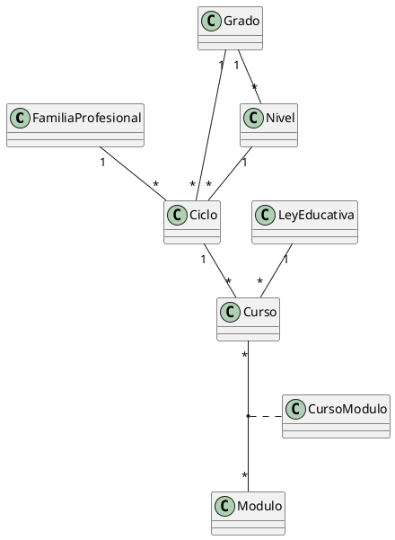

# Tarea 04 a implementar

## Skills a usar
Para hacer esta tarea vas a usar estos skills
- k-sistemas

**El XML ya está materializado en `design/domains/Ciclo.xml`.** **MUST** copiarlo **literalmente** (`cp`) a su ruta destino `src/main/java/com/educaflow/subsystem/sistemaeducativo/domains/Ciclo.xml`. **MUST NOT** regenerarlo, reescribirlo desde el `design.md` ni reformatearlo.

**Acción `Modificar`: el destino YA EXISTE.** Antes de sobrescribirlo aplica la **comprobación de conservación** de `implementation.md` §3 (todo elemento con nombre del fichero real actual debe estar presente en el XML del diseño, salvo los listados en «Eliminaciones declaradas» del `design.md` — para este fichero no hay ninguno). Si pasa, sobrescribe; si falla, reporta `CONFLICT`.

De todo el Paso 2 que se copia debajo, lo que esta tarea materializa es el bloque **`domains/Ciclo.xml`**, que **no tiene delta de campos**: el fichero se copia verbatim y el resultado debe ser idéntico al actual.

## Fila de la tabla «Ficheros a crear o modificar» del diseño

| Fichero | Acción | Skill | Descripción |
|---------|--------|-------|-------------|
| `src/main/java/com/educaflow/subsystem/sistemaeducativo/domains/Ciclo.xml` | Modificar | k-sistemas (modelos.md) | **Sin delta de campos**: se copia verbatim (el fichero real no cambia). El nivel sigue siendo opcional en el modelo porque su obligatoriedad es condicional. |

## Paso 2 del diseño (verbatim)

### Paso 2 — Dominios

Tres ficheros de `domains/` (XML completo en `design/domains/`) y el diagrama del subsistema.

**`domains/Grado.xml`** — resumen estructural:

- Preexistente (se conserva): `code` (string, required), `name` (string, namecolumn, required).
- Delta: `one-to-many niveles` → `Nivel`, `mappedBy="grado"`, **`orphanRemoval="false"` explícito**. Es la relación que el `model.puml` de la spec nombra (`Grado "1" --> "0..*" Nivel : niveles`). **CRITICAL — el atributo NO es redundante y MUST escribirse**: en una one-to-many **bidireccional** (con `mappedBy`), si el atributo se omite el generador lo considera `true` (`axelor-tools .../code/entity/model/Property.java:472-478`) y emite `@OneToMany(..., cascade = CascadeType.ALL, orphanRemoval = true)` (`:1232-1250` + `:1171-1192`; hay evidencia empírica en `axelor-tools/src/test/resources/domains/domains.xml:105`), con lo que **borrar un grado borraría sus niveles** — justo lo contrario de lo que exige la sección «Relaciones» de la spec. Declarándolo a `false`, `resolveCascadeTypes` vuelve a `PERSIST,MERGE` y no se emite `orphanRemoval`; en runtime `Mapper` marca la propiedad como *orphan* (`orphan = !oneToMany.orphanRemoval()`), de modo que `ModelServiceValidationWalker` (`:253-261`, que solo desciende por las O2M de **composición**, las de `!isOrphan()`) deja de descender por `Grado.niveles`, que es lo correcto: los niveles no son detalles de composición del grado.
- Delta: `boolean admiteNivel` con `transient="true"` y cuerpo de cálculo (`CC-Grado-001`). Al ser un campo con contenido, el generador de AOP emite `@Transient @VirtualColumn Boolean admiteNivel`, un `computeAdmiteNivel()` con ese cuerpo y un getter que **recalcula antes de devolver**. Sin columna en base de datos y sin valor que el cliente pueda conservar. El cálculo es «cierto si el grado tiene al menos un nivel **no archivado**» (ver `decisiones.md` D7).
- **El cuerpo del `compute*` MUST leer el CAMPO `niveles`, nunca `getNiveles()`.** `Mapper.findComputeDependencies` (axelor-core, líneas 287-315) recorre el bytecode del método `compute*` y registra como dependencias **solo** las instrucciones `GETFIELD`; con el getter (`INVOKEVIRTUAL`) el conjunto de dependencias queda **vacío**, y es justo ese conjunto el que usa `ContextHandler.interceptComputeAccess` para poblar `niveles` antes de invocar el cálculo. Sobre un `Grado` que llegue como proxy de `Context`, `admiteNivel` respondería `false` **sin ningún error**. Es lo que hace que el campo declare su dependencia.

**`domains/Nivel.xml`** — resumen estructural:

- Preexistente (se conserva): `code` (string, required), `name` (string, namecolumn, required).
- Delta: `many-to-one grado` → `Grado`, `required="true"`. Es la capa declarativa de `RES-Nivel-001` (columna `NOT NULL` + `@NotNull`) y además hace que el formulario marque el campo como obligatorio sin declararlo en la vista (`k-validaciones/restricciones.md` §1) → es la ubicación de `U-niveles-001`.

**`domains/Ciclo.xml`** — resumen estructural:

- Preexistente (se conserva): `code`, `name`, `cursos` (o2m a `Curso`), `familiaProfesional` (m2o required), `grado` (m2o required), `nivel` (m2o opcional).
- Delta: **ninguno**. `nivel` sigue **sin** `required` porque su obligatoriedad depende del grado y no es declarable; vive en `V-Ciclo-001`.

**`domains/tablas.plantuml`** — contenido resultante (el fichero es documentación, no un artefacto materializado en `design/`):



**Verificación del paso:** `./gradlew build` genera `Grado.java` con `getAdmiteNivel()`/`computeAdmiteNivel()` y `Nivel.java` con `getGrado()`; `./gradlew -q GenerateDocs` deja `domains/tablas.png` más reciente que `domains/tablas.plantuml` (la tarea es incremental por fecha, así que si no se regenera el PNG queda desincronizado). Comprobar además en el `Grado.java` generado (`build/src-gen`) que la colección sale como `@OneToMany(fetch = LAZY, mappedBy = "grado", cascade = {PERSIST, MERGE})` — **sin** `orphanRemoval = true` y **sin** `cascade = ALL`: si aparece cualquiera de los dos, falta el `orphanRemoval="false"` del dominio y el borrado en cascada estaría activo.

**CRITICAL — el esquema no se actualiza solo.** `Nivel.grado required="true"` es una columna **`NOT NULL` nueva sobre `sistemaeducativo_nivel`, que ya está poblada** (`GB`, `GM`, `GS`). El proyecto arranca con `db.default.ddl = update` (`agent_docs/deploy.md`) y un `ALTER TABLE ... ADD COLUMN ... NOT NULL` sobre una tabla con filas **falla**: Hibernate registra el error y continúa, así que la aplicación arranca con el esquema a medias y el data-init del Paso 12 no puede aplicarse — un fallo **silencioso** justo en el paso que parece trivial. Es el único punto del delta que toca el esquema de una tabla con datos, y **la vía de este diseño es RESETEAR LA BASE DE DATOS**: no hay nada que elegir al implementar.

**La vía: resetear la base de datos.** Antes del primer arranque con este delta, ejecutar literalmente (comando de `agent_docs/deploy.md`, «Arrancar / reiniciar la BD (Docker)» → «Resetear desde cero»; el `docker run` usa `--rm` y no monta volumen, así que al parar el contenedor se borra su almacenamiento y vuelve a nacer limpio):

```bash
docker stop educaflow-db
docker run --name educaflow-db --hostname educaflow-db \
  -e POSTGRES_USER=educaflow -e POSTGRES_PASSWORD=educaflow -e POSTGRES_DB=educaflow \
  -p 5432:5432 -d --rm postgres:12.22
```

Con la base de datos limpia, el `ALTER TABLE` deja de existir como problema: Axelor **crea** el esquema entero desde cero al arrancar la app con `ddl = update`, y los data-init (Paso 12, más los del resto de sistemas) repueblan todos los catálogos.

**Por qué resetear es aceptable aquí:** el esquema es íntegramente reconstruible y **no hay ningún dato de usuario que preservar** — todo lo que vive en las tablas de este subsistema (`Grado`, `Nivel`, `Ciclo`, familias profesionales, cursos, módulos…) viene de `data-init`, que se reaplica en cada arranque. De hecho, en el entorno de desarrollo actual la base de datos está vacía: 0 tablas en el esquema `public`.

**Nota (solo para entornos donde la base de datos NO se pueda resetear, p. ej. una instalación ya en uso).** Ahí la alternativa es un script Flyway en la *location* que `DataBaseStartup.executeMigrate` ya declara (`classpath:com/educaflow/secretariavirtual/startup/database`), cuya carpeta todavía **NO** existe en `src/main/resources` y habría que crear junto con el primer script `Vx__*.sql`: `ADD COLUMN` nullable → `UPDATE` rellenando el grado `D` en las tres filas → `SET NOT NULL`. **Queda fuera del alcance de esta iniciativa**: no se escribe desde este diseño.


## Notas y supuestos aplicables (verbatim)

5. **Sin `title` en los campos nuevos del dominio, salvo `admiteNivel`.** Los dominios de este subsistema no declaran `title` (Axelor humaniza el nombre) y el delta sigue esa costumbre; `admiteNivel` sí lo lleva porque su nombre no se lee solo. **MUST NOT** crearse ni tocarse los `i18n_es.csv`/`i18n_ca.csv`: los genera un script.
7. **Niveles archivados.** `CC-Grado-001` dice literalmente «cierto si el grado tiene al menos un nivel en el catálogo de niveles». El diseño lo **ajusta** a «al menos un nivel **no archivado**» (ver `decisiones.md` D7). Motivo: el selector de nivel filtra por `domain="self.grado = :grado"` y Axelor no ofrece registros archivados, así que un grado con **todos** sus niveles archivados daría `admiteNivel = true`, mostraría el panel con el nivel marcado obligatorio, `V-Ciclo-001` lo exigiría y el usuario no tendría ninguno que elegir: un estado sin salida en el que ningún ciclo de ese grado se podría guardar. El ajuste es coherente con la intención de la regla («que el grado sepa si sus ciclos pueden llevar nivel»), no con su letra.
9. **Comportamiento del walker con `orphanRemoval="false"`.** Con el atributo declarado a `false` en `Grado.niveles`, `ModelServiceValidationWalker` (`:253-261`) **no** desciende por esa colección al guardar un grado, que es lo correcto: los niveles no son detalles de composición del grado, se mantienen desde su propia pantalla. Lo contrario ocurre —y se aprovecha— en `FamiliaProfesional.ciclos`, que sí es una colección de composición: por ella el walker desciende y ejecuta `CicloServiceImpl.validate*` sobre cada ciclo del modal (ver Paso 9).
